# **Machine Learning - Classification**
### I Presentation of the problem 

###  **Lending club : loan defaulters prediction**

###### Lending Club is a lending platform that lends money to people in need at an interest rate based on their credit history and other factors.
###### will use Machine learning  to predict whether the loan holder will pay back the loan or not, with help of several algorithms and based on the result obtained we can help the company predict the repayment of the loan or to considere the loan as a loss

## **II Presenting the different ML approaches and algorithms**

### A-The approches

* understanding and identifying data
* data preparation
* determine the model's features and train the model
* Evaluation
* deployment

### B- Algorithms

* Logistic Regression
* Linear Discriminant Analysis
* Decision Tree
* K-Nearest Neighbors Classifier
* Support Vector Machine
* Random Forest
* Bagging
* Extra Trees
* AdaBoost
* Gradient Boosting

## III Data Overview

#### III-A- Load libraries


```python
import numpy as np 
import pandas as pd 
import matplotlib.pyplot as plt
import seaborn as sns
%matplotlib inline
import warnings
warnings.filterwarnings('ignore')
```


```python
pd.reset_option('all')
df = pd.read_csv('lending-club-loan-data-2007-11-QueryResult.csv')
df.head()
```


<div>
<style scoped>
    .dataframe tbody tr th:only-of-type {
        vertical-align: middle;
    }

    .dataframe tbody tr th {
        vertical-align: top;
    }

    .dataframe thead th {
        text-align: right;
    }
</style>
<table border="1" class="dataframe">
  <thead>
    <tr style="text-align: right;">
      <th></th>
      <th>id</th>
      <th>member_id</th>
      <th>loan_amnt</th>
      <th>funded_amnt</th>
      <th>funded_amnt_inv</th>
      <th>term</th>
      <th>int_rate</th>
      <th>installment</th>
      <th>grade</th>
      <th>sub_grade</th>
      <th>...</th>
      <th>num_tl_90g_dpd_24m</th>
      <th>num_tl_op_past_12m</th>
      <th>pct_tl_nvr_dlq</th>
      <th>percent_bc_gt_75</th>
      <th>pub_rec_bankruptcies</th>
      <th>tax_liens</th>
      <th>tot_hi_cred_lim</th>
      <th>total_bal_ex_mort</th>
      <th>total_bc_limit</th>
      <th>total_il_high_credit_limit</th>
    </tr>
  </thead>
  <tbody>
    <tr>
      <th>0</th>
      <td>1077501</td>
      <td>1296599.0</td>
      <td>5000.0</td>
      <td>5000.0</td>
      <td>4975.0</td>
      <td>36 months</td>
      <td>0.1065</td>
      <td>162.87</td>
      <td>B</td>
      <td>B2</td>
      <td>...</td>
      <td>NaN</td>
      <td>NaN</td>
      <td>NaN</td>
      <td>NaN</td>
      <td>0.0</td>
      <td>False</td>
      <td>NaN</td>
      <td>NaN</td>
      <td>NaN</td>
      <td>NaN</td>
    </tr>
    <tr>
      <th>1</th>
      <td>1077430</td>
      <td>1314167.0</td>
      <td>2500.0</td>
      <td>2500.0</td>
      <td>2500.0</td>
      <td>60 months</td>
      <td>0.1527</td>
      <td>59.83</td>
      <td>C</td>
      <td>C4</td>
      <td>...</td>
      <td>NaN</td>
      <td>NaN</td>
      <td>NaN</td>
      <td>NaN</td>
      <td>0.0</td>
      <td>False</td>
      <td>NaN</td>
      <td>NaN</td>
      <td>NaN</td>
      <td>NaN</td>
    </tr>
    <tr>
      <th>2</th>
      <td>1070078</td>
      <td>1305201.0</td>
      <td>6500.0</td>
      <td>6500.0</td>
      <td>6500.0</td>
      <td>60 months</td>
      <td>0.1465</td>
      <td>153.45</td>
      <td>C</td>
      <td>C3</td>
      <td>...</td>
      <td>NaN</td>
      <td>NaN</td>
      <td>NaN</td>
      <td>NaN</td>
      <td>0.0</td>
      <td>False</td>
      <td>NaN</td>
      <td>NaN</td>
      <td>NaN</td>
      <td>NaN</td>
    </tr>
    <tr>
      <th>3</th>
      <td>1068509</td>
      <td>1302907.0</td>
      <td>6200.0</td>
      <td>6200.0</td>
      <td>6200.0</td>
      <td>36 months</td>
      <td>0.0991</td>
      <td>199.80</td>
      <td>B</td>
      <td>B1</td>
      <td>...</td>
      <td>NaN</td>
      <td>NaN</td>
      <td>NaN</td>
      <td>NaN</td>
      <td>0.0</td>
      <td>False</td>
      <td>NaN</td>
      <td>NaN</td>
      <td>NaN</td>
      <td>NaN</td>
    </tr>
    <tr>
      <th>4</th>
      <td>1057330</td>
      <td>1288893.0</td>
      <td>14000.0</td>
      <td>14000.0</td>
      <td>14000.0</td>
      <td>36 months</td>
      <td>0.1427</td>
      <td>480.33</td>
      <td>C</td>
      <td>C2</td>
      <td>...</td>
      <td>NaN</td>
      <td>NaN</td>
      <td>NaN</td>
      <td>NaN</td>
      <td>0.0</td>
      <td>False</td>
      <td>NaN</td>
      <td>NaN</td>
      <td>NaN</td>
      <td>NaN</td>
    </tr>
  </tbody>
</table>
<p>5 rows × 115 columns</p>
</div>


```python
print('Number of rows   :',df.shape[0])
print('Number of columns:',df.shape[1])
```

    Number of rows   : 42538
    Number of columns: 115
    

#### III-B Data Description


```python
df['delinq_amnt'].value_counts()
```


    0.0       42504
    27.0          1
    6053.0        1
    Name: delinq_amnt, dtype: int64


```python
df.describe()
```


<div>
<style scoped>
    .dataframe tbody tr th:only-of-type {
        vertical-align: middle;
    }

    .dataframe tbody tr th {
        vertical-align: top;
    }

    .dataframe thead th {
        text-align: right;
    }
</style>
<table border="1" class="dataframe">
  <thead>
    <tr style="text-align: right;">
      <th></th>
      <th>member_id</th>
      <th>loan_amnt</th>
      <th>funded_amnt</th>
      <th>funded_amnt_inv</th>
      <th>int_rate</th>
      <th>installment</th>
      <th>annual_inc</th>
      <th>dti</th>
      <th>delinq_2yrs</th>
      <th>fico_range_low</th>
      <th>...</th>
      <th>num_tl_30dpd</th>
      <th>num_tl_90g_dpd_24m</th>
      <th>num_tl_op_past_12m</th>
      <th>pct_tl_nvr_dlq</th>
      <th>percent_bc_gt_75</th>
      <th>pub_rec_bankruptcies</th>
      <th>tot_hi_cred_lim</th>
      <th>total_bal_ex_mort</th>
      <th>total_bc_limit</th>
      <th>total_il_high_credit_limit</th>
    </tr>
  </thead>
  <tbody>
    <tr>
      <th>count</th>
      <td>4.253500e+04</td>
      <td>42535.000000</td>
      <td>42535.000000</td>
      <td>42535.000000</td>
      <td>42535.000000</td>
      <td>42535.000000</td>
      <td>4.253100e+04</td>
      <td>42535.000000</td>
      <td>42506.000000</td>
      <td>42535.000000</td>
      <td>...</td>
      <td>0.0</td>
      <td>0.0</td>
      <td>0.0</td>
      <td>0.0</td>
      <td>0.0</td>
      <td>41170.000000</td>
      <td>0.0</td>
      <td>0.0</td>
      <td>0.0</td>
      <td>0.0</td>
    </tr>
    <tr>
      <th>mean</th>
      <td>8.257026e+05</td>
      <td>11089.722581</td>
      <td>10821.585753</td>
      <td>10139.830603</td>
      <td>0.121650</td>
      <td>322.623063</td>
      <td>6.913656e+04</td>
      <td>13.373043</td>
      <td>0.152449</td>
      <td>713.052545</td>
      <td>...</td>
      <td>NaN</td>
      <td>NaN</td>
      <td>NaN</td>
      <td>NaN</td>
      <td>NaN</td>
      <td>0.045227</td>
      <td>NaN</td>
      <td>NaN</td>
      <td>NaN</td>
      <td>NaN</td>
    </tr>
    <tr>
      <th>std</th>
      <td>2.795409e+05</td>
      <td>7410.938391</td>
      <td>7146.914675</td>
      <td>7131.686447</td>
      <td>0.037079</td>
      <td>208.927216</td>
      <td>6.409635e+04</td>
      <td>6.726315</td>
      <td>0.512406</td>
      <td>36.188439</td>
      <td>...</td>
      <td>NaN</td>
      <td>NaN</td>
      <td>NaN</td>
      <td>NaN</td>
      <td>NaN</td>
      <td>0.208737</td>
      <td>NaN</td>
      <td>NaN</td>
      <td>NaN</td>
      <td>NaN</td>
    </tr>
    <tr>
      <th>min</th>
      <td>7.047300e+04</td>
      <td>500.000000</td>
      <td>500.000000</td>
      <td>0.000000</td>
      <td>0.054200</td>
      <td>15.670000</td>
      <td>1.896000e+03</td>
      <td>0.000000</td>
      <td>0.000000</td>
      <td>610.000000</td>
      <td>...</td>
      <td>NaN</td>
      <td>NaN</td>
      <td>NaN</td>
      <td>NaN</td>
      <td>NaN</td>
      <td>0.000000</td>
      <td>NaN</td>
      <td>NaN</td>
      <td>NaN</td>
      <td>NaN</td>
    </tr>
    <tr>
      <th>25%</th>
      <td>6.384795e+05</td>
      <td>5200.000000</td>
      <td>5000.000000</td>
      <td>4950.000000</td>
      <td>0.096300</td>
      <td>165.520000</td>
      <td>4.000000e+04</td>
      <td>8.200000</td>
      <td>0.000000</td>
      <td>685.000000</td>
      <td>...</td>
      <td>NaN</td>
      <td>NaN</td>
      <td>NaN</td>
      <td>NaN</td>
      <td>NaN</td>
      <td>0.000000</td>
      <td>NaN</td>
      <td>NaN</td>
      <td>NaN</td>
      <td>NaN</td>
    </tr>
    <tr>
      <th>50%</th>
      <td>8.241780e+05</td>
      <td>9700.000000</td>
      <td>9600.000000</td>
      <td>8500.000000</td>
      <td>0.119900</td>
      <td>277.690000</td>
      <td>5.900000e+04</td>
      <td>13.470000</td>
      <td>0.000000</td>
      <td>710.000000</td>
      <td>...</td>
      <td>NaN</td>
      <td>NaN</td>
      <td>NaN</td>
      <td>NaN</td>
      <td>NaN</td>
      <td>0.000000</td>
      <td>NaN</td>
      <td>NaN</td>
      <td>NaN</td>
      <td>NaN</td>
    </tr>
    <tr>
      <th>75%</th>
      <td>1.033946e+06</td>
      <td>15000.000000</td>
      <td>15000.000000</td>
      <td>14000.000000</td>
      <td>0.147200</td>
      <td>428.180000</td>
      <td>8.250000e+04</td>
      <td>18.680000</td>
      <td>0.000000</td>
      <td>740.000000</td>
      <td>...</td>
      <td>NaN</td>
      <td>NaN</td>
      <td>NaN</td>
      <td>NaN</td>
      <td>NaN</td>
      <td>0.000000</td>
      <td>NaN</td>
      <td>NaN</td>
      <td>NaN</td>
      <td>NaN</td>
    </tr>
    <tr>
      <th>max</th>
      <td>1.314167e+06</td>
      <td>35000.000000</td>
      <td>35000.000000</td>
      <td>35000.000000</td>
      <td>0.245900</td>
      <td>1305.190000</td>
      <td>6.000000e+06</td>
      <td>29.990000</td>
      <td>13.000000</td>
      <td>825.000000</td>
      <td>...</td>
      <td>NaN</td>
      <td>NaN</td>
      <td>NaN</td>
      <td>NaN</td>
      <td>NaN</td>
      <td>2.000000</td>
      <td>NaN</td>
      <td>NaN</td>
      <td>NaN</td>
      <td>NaN</td>
    </tr>
  </tbody>
</table>
<p>8 rows × 87 columns</p>
</div>


## **IV Exploratroy Data Analysis** 

#### IV-A Type of Variables


```python
pd.set_option('display.max_rows', None)
df.dtypes
```


    id                                 object
    member_id                         float64
    loan_amnt                         float64
    funded_amnt                       float64
    funded_amnt_inv                   float64
    term                               object
    int_rate                          float64
    installment                       float64
    grade                              object
    sub_grade                          object
    emp_title                          object
    emp_length                         object
    home_ownership                     object
    annual_inc                        float64
    verification_status                object
    issue_d                            object
    loan_status                        object
    pymnt_plan                         object
    url                                object
    desc                               object
    purpose                            object
    title                              object
    zip_code                           object
    addr_state                         object
    dti                               float64
    delinq_2yrs                       float64
    earliest_cr_line                   object
    fico_range_low                    float64
    fico_range_high                   float64
    inq_last_6mths                    float64
    mths_since_last_delinq            float64
    mths_since_last_record            float64
    open_acc                          float64
    pub_rec                           float64
    revol_bal                         float64
    revol_util                        float64
    total_acc                         float64
    initial_list_status                object
    out_prncp                         float64
    out_prncp_inv                     float64
    total_pymnt                       float64
    total_pymnt_inv                   float64
    total_rec_prncp                   float64
    total_rec_int                     float64
    total_rec_late_fee                float64
    recoveries                        float64
    collection_recovery_fee           float64
    last_pymnt_d                       object
    last_pymnt_amnt                   float64
    next_pymnt_d                       object
    last_credit_pull_d                 object
    last_fico_range_high              float64
    last_fico_range_low               float64
    collections_12_mths_ex_med         object
    mths_since_last_major_derog       float64
    policy_code                        object
    application_type                   object
    annual_inc_joint                  float64
    dti_joint                         float64
    verification_status_joint         float64
    acc_now_delinq                     object
    tot_coll_amt                      float64
    tot_cur_bal                       float64
    open_acc_6m                       float64
    open_il_6m                        float64
    open_il_12m                       float64
    open_il_24m                       float64
    mths_since_rcnt_il                float64
    total_bal_il                      float64
    il_util                           float64
    open_rv_12m                       float64
    open_rv_24m                       float64
    max_bal_bc                        float64
    all_util                          float64
    total_rev_hi_lim                  float64
    inq_fi                            float64
    total_cu_tl                       float64
    inq_last_12m                      float64
    acc_open_past_24mths              float64
    avg_cur_bal                       float64
    bc_open_to_buy                    float64
    bc_util                           float64
    chargeoff_within_12_mths           object
    delinq_amnt                       float64
    mo_sin_old_il_acct                float64
    mo_sin_old_rev_tl_op              float64
    mo_sin_rcnt_rev_tl_op             float64
    mo_sin_rcnt_tl                    float64
    mort_acc                          float64
    mths_since_recent_bc              float64
    mths_since_recent_bc_dlq          float64
    mths_since_recent_inq             float64
    mths_since_recent_revol_delinq    float64
    num_accts_ever_120_pd             float64
    num_actv_bc_tl                    float64
    num_actv_rev_tl                   float64
    num_bc_sats                       float64
    num_bc_tl                         float64
    num_il_tl                         float64
    num_op_rev_tl                     float64
    num_rev_accts                     float64
    num_rev_tl_bal_gt_0               float64
    num_sats                          float64
    num_tl_120dpd_2m                  float64
    num_tl_30dpd                      float64
    num_tl_90g_dpd_24m                float64
    num_tl_op_past_12m                float64
    pct_tl_nvr_dlq                    float64
    percent_bc_gt_75                  float64
    pub_rec_bankruptcies              float64
    tax_liens                          object
    tot_hi_cred_lim                   float64
    total_bal_ex_mort                 float64
    total_bc_limit                    float64
    total_il_high_credit_limit        float64
    dtype: object


#### I notice  that the most variables are  of type float and object, in the preporcessing step moste of them will be encoded to be readable for ml algorithms

#### **IV-B Specification of Target Variable**


```python
df['loan_status'].value_counts()
```


    Fully Paid                                             33586
    Charged Off                                             5653
    Does not meet the credit policy. Status:Fully Paid      1988
    Does not meet the credit policy. Status:Charged Off      761
    Current                                                  513
    In Grace Period                                           16
    Late (31-120 days)                                        12
    Late (16-30 days)                                          5
    Default                                                    1
    Name: loan_status, dtype: int64


```python
x = plt.subplots(figsize=(7, 3))
sns.countplot(y="loan_status", data=df)
```


    <AxesSubplot:xlabel='count', ylabel='loan_status'>


    
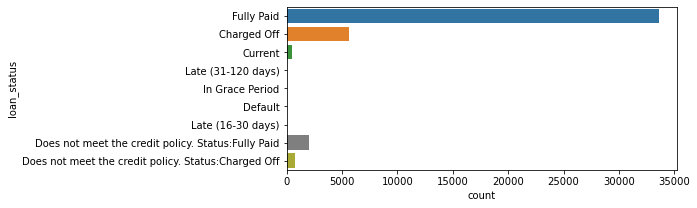
    


* we can see that fully paid is the dominant value so it will be necessary to balance the data in modeling step 
* fully paid will be grouped in one variable the charged off also will be grouped in one variable

#### **IV-C Plot Indipendent Variables**


```python
fig, axs = plt.subplots(2, 2, figsize=(9, 7))
sns.histplot(data=df, y="emp_length", kde=True, color="skyblue", ax=axs[0, 0])
sns.histplot(data=df, x="term", color="olive", ax=axs[0, 1])
sns.histplot(data=df, x="pub_rec_bankruptcies", color="gold", ax=axs[1, 0])
sns.histplot(data=df, x="grade", color="teal", ax=axs[1, 1])
plt.show()
```


    
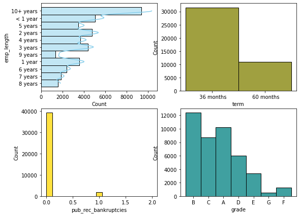
    


* emp_length: the variable values are varied from 0 year experience to 10 years experience so it will be encoded in preprocessing step**
* pub_rec_bankruptcy:This variable varies from 0 to 1 and we clearly see that there some who file bankruptcy recoreds**
* Terme :The loan is remburse after 36 months or 60 months we have two values so its= will be label encoded in the preprocessing step so the model wil recongnise the values**
* Grade : eache category of borrowers are assigned to a grade with clearly the B and A are the most important also this variable will be label encoded to be model readable**


```python
fig, axs = plt.subplots(2, 2, figsize=(9, 7))
sns.histplot(data=df, x="fico_range_high", color="skyblue", ax=axs[0, 0])
sns.histplot(data=df, x="fico_range_low", color="olive", ax=axs[0, 1])
sns.histplot(data=df, x="last_fico_range_high", color="gold", ax=axs[1, 0])
sns.histplot(data=df, x="last_fico_range_low", color="teal", ax=axs[1, 1])
plt.show()
```


    
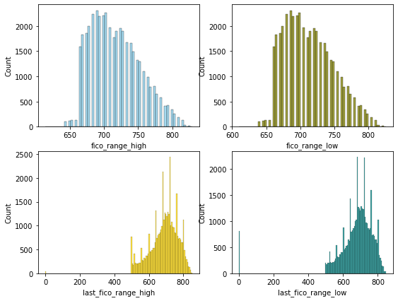
    


```python
print(np.max(df['fico_range_high'] - df['fico_range_low']))
print(np.min(df['fico_range_high'] - df['fico_range_low']))
```

    4.0
    4.0
    


```python
np.sum(df['fico_range_high'] - df['fico_range_low'])/42538
```


    3.9997178992900464


```python
np.sum(df['fico_range_high'] - df['fico_range_low'])
```


    170140.0


```python
print(np.min(df['last_fico_range_high'] - df['last_fico_range_low']))
print(np.max(df['last_fico_range_high'] - df['last_fico_range_low']))
```

    0.0
    499.0
    


```python
np.sum(df['last_fico_range_high'] - df['last_fico_range_low'])/42538
```


    12.921646527810429


```python
np.sum(df['last_fico_range_high'] - df['last_fico_range_low'])
```


    549661.0


* fico_range columns dosnt have much difference they are pretty much linear I will generate a new column out of the two that generate the mean
* late_fico_range also we have a slight difference between two variables for the sake of the model will remove both of them I will  work on that in the preprocessing step in details

#### ploting the loan status vs the Grade


```python
plt.figure(figsize=(10,5))
sns.countplot(x='grade', data=df, hue='loan_status')
```


    <AxesSubplot:xlabel='grade', ylabel='count'>


    
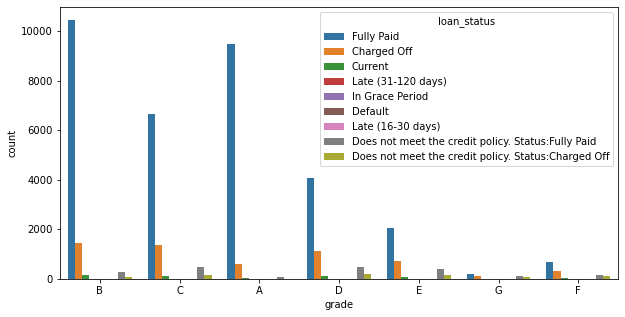
    


##### the ones with grade B C AND A clearly they have high probability of repaying the loan unlike the remaining gardes

#### ploting the installment vs loan amount


```python
sns.scatterplot(x ="installment", y ="loan_amnt",data = df);
```


    
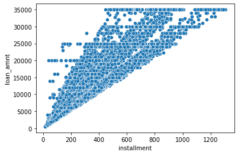
    


#### we can see that the loan is clearly being paiedby the ones who have high installement

## **Data Preprocessing**

### **Data Cleaning**

#### **Calculating how much missing data we have per variable**

#### **I define a function that will help me every time I clean the data and see the progress of null values treatment**


```python
pd.set_option('display.max_rows', 120)
def nul_calcul(df):
    null_df=pd.DataFrame()
    null_df['Features']=df.isnull().sum().index
    null_df['Null values']=df.isnull().sum().values
    null_df['% Null values']=(df.isnull().sum().values / df.shape[0])*100
    return null_df.sort_values(by='% Null values',ascending=False)
nul_calcul(df)
```


<div>
<style scoped>
    .dataframe tbody tr th:only-of-type {
        vertical-align: middle;
    }

    .dataframe tbody tr th {
        vertical-align: top;
    }

    .dataframe thead th {
        text-align: right;
    }
</style>
<table border="1" class="dataframe">
  <thead>
    <tr style="text-align: right;">
      <th></th>
      <th>Features</th>
      <th>Null values</th>
      <th>% Null values</th>
    </tr>
  </thead>
  <tbody>
    <tr>
      <th>57</th>
      <td>annual_inc_joint</td>
      <td>42538</td>
      <td>100.000000</td>
    </tr>
    <tr>
      <th>86</th>
      <td>mo_sin_rcnt_rev_tl_op</td>
      <td>42538</td>
      <td>100.000000</td>
    </tr>
    <tr>
      <th>84</th>
      <td>mo_sin_old_il_acct</td>
      <td>42538</td>
      <td>100.000000</td>
    </tr>
    <tr>
      <th>81</th>
      <td>bc_util</td>
      <td>42538</td>
      <td>100.000000</td>
    </tr>
    <tr>
      <th>80</th>
      <td>bc_open_to_buy</td>
      <td>42538</td>
      <td>100.000000</td>
    </tr>
    <tr>
      <th>79</th>
      <td>avg_cur_bal</td>
      <td>42538</td>
      <td>100.000000</td>
    </tr>
    <tr>
      <th>78</th>
      <td>acc_open_past_24mths</td>
      <td>42538</td>
      <td>100.000000</td>
    </tr>
    <tr>
      <th>77</th>
      <td>inq_last_12m</td>
      <td>42538</td>
      <td>100.000000</td>
    </tr>
    <tr>
      <th>76</th>
      <td>total_cu_tl</td>
      <td>42538</td>
      <td>100.000000</td>
    </tr>
    <tr>
      <th>75</th>
      <td>inq_fi</td>
      <td>42538</td>
      <td>100.000000</td>
    </tr>
    <tr>
      <th>74</th>
      <td>total_rev_hi_lim</td>
      <td>42538</td>
      <td>100.000000</td>
    </tr>
    <tr>
      <th>73</th>
      <td>all_util</td>
      <td>42538</td>
      <td>100.000000</td>
    </tr>
    <tr>
      <th>72</th>
      <td>max_bal_bc</td>
      <td>42538</td>
      <td>100.000000</td>
    </tr>
    <tr>
      <th>71</th>
      <td>open_rv_24m</td>
      <td>42538</td>
      <td>100.000000</td>
    </tr>
    <tr>
      <th>70</th>
      <td>open_rv_12m</td>
      <td>42538</td>
      <td>100.000000</td>
    </tr>
    <tr>
      <th>69</th>
      <td>il_util</td>
      <td>42538</td>
      <td>100.000000</td>
    </tr>
    <tr>
      <th>68</th>
      <td>total_bal_il</td>
      <td>42538</td>
      <td>100.000000</td>
    </tr>
    <tr>
      <th>67</th>
      <td>mths_since_rcnt_il</td>
      <td>42538</td>
      <td>100.000000</td>
    </tr>
    <tr>
      <th>66</th>
      <td>open_il_24m</td>
      <td>42538</td>
      <td>100.000000</td>
    </tr>
    <tr>
      <th>65</th>
      <td>open_il_12m</td>
      <td>42538</td>
      <td>100.000000</td>
    </tr>
    <tr>
      <th>64</th>
      <td>open_il_6m</td>
      <td>42538</td>
      <td>100.000000</td>
    </tr>
    <tr>
      <th>63</th>
      <td>open_acc_6m</td>
      <td>42538</td>
      <td>100.000000</td>
    </tr>
    <tr>
      <th>62</th>
      <td>tot_cur_bal</td>
      <td>42538</td>
      <td>100.000000</td>
    </tr>
    <tr>
      <th>61</th>
      <td>tot_coll_amt</td>
      <td>42538</td>
      <td>100.000000</td>
    </tr>
    <tr>
      <th>59</th>
      <td>verification_status_joint</td>
      <td>42538</td>
      <td>100.000000</td>
    </tr>
    <tr>
      <th>85</th>
      <td>mo_sin_old_rev_tl_op</td>
      <td>42538</td>
      <td>100.000000</td>
    </tr>
    <tr>
      <th>87</th>
      <td>mo_sin_rcnt_tl</td>
      <td>42538</td>
      <td>100.000000</td>
    </tr>
    <tr>
      <th>54</th>
      <td>mths_since_last_major_derog</td>
      <td>42538</td>
      <td>100.000000</td>
    </tr>
    <tr>
      <th>88</th>
      <td>mort_acc</td>
      <td>42538</td>
      <td>100.000000</td>
    </tr>
    <tr>
      <th>113</th>
      <td>total_bc_limit</td>
      <td>42538</td>
      <td>100.000000</td>
    </tr>
    <tr>
      <th>112</th>
      <td>total_bal_ex_mort</td>
      <td>42538</td>
      <td>100.000000</td>
    </tr>
    <tr>
      <th>111</th>
      <td>tot_hi_cred_lim</td>
      <td>42538</td>
      <td>100.000000</td>
    </tr>
    <tr>
      <th>108</th>
      <td>percent_bc_gt_75</td>
      <td>42538</td>
      <td>100.000000</td>
    </tr>
    <tr>
      <th>107</th>
      <td>pct_tl_nvr_dlq</td>
      <td>42538</td>
      <td>100.000000</td>
    </tr>
    <tr>
      <th>106</th>
      <td>num_tl_op_past_12m</td>
      <td>42538</td>
      <td>100.000000</td>
    </tr>
    <tr>
      <th>105</th>
      <td>num_tl_90g_dpd_24m</td>
      <td>42538</td>
      <td>100.000000</td>
    </tr>
    <tr>
      <th>104</th>
      <td>num_tl_30dpd</td>
      <td>42538</td>
      <td>100.000000</td>
    </tr>
    <tr>
      <th>103</th>
      <td>num_tl_120dpd_2m</td>
      <td>42538</td>
      <td>100.000000</td>
    </tr>
    <tr>
      <th>102</th>
      <td>num_sats</td>
      <td>42538</td>
      <td>100.000000</td>
    </tr>
    <tr>
      <th>101</th>
      <td>num_rev_tl_bal_gt_0</td>
      <td>42538</td>
      <td>100.000000</td>
    </tr>
    <tr>
      <th>100</th>
      <td>num_rev_accts</td>
      <td>42538</td>
      <td>100.000000</td>
    </tr>
    <tr>
      <th>99</th>
      <td>num_op_rev_tl</td>
      <td>42538</td>
      <td>100.000000</td>
    </tr>
    <tr>
      <th>98</th>
      <td>num_il_tl</td>
      <td>42538</td>
      <td>100.000000</td>
    </tr>
    <tr>
      <th>97</th>
      <td>num_bc_tl</td>
      <td>42538</td>
      <td>100.000000</td>
    </tr>
    <tr>
      <th>96</th>
      <td>num_bc_sats</td>
      <td>42538</td>
      <td>100.000000</td>
    </tr>
    <tr>
      <th>95</th>
      <td>num_actv_rev_tl</td>
      <td>42538</td>
      <td>100.000000</td>
    </tr>
    <tr>
      <th>94</th>
      <td>num_actv_bc_tl</td>
      <td>42538</td>
      <td>100.000000</td>
    </tr>
    <tr>
      <th>93</th>
      <td>num_accts_ever_120_pd</td>
      <td>42538</td>
      <td>100.000000</td>
    </tr>
    <tr>
      <th>92</th>
      <td>mths_since_recent_revol_delinq</td>
      <td>42538</td>
      <td>100.000000</td>
    </tr>
    <tr>
      <th>91</th>
      <td>mths_since_recent_inq</td>
      <td>42538</td>
      <td>100.000000</td>
    </tr>
    <tr>
      <th>90</th>
      <td>mths_since_recent_bc_dlq</td>
      <td>42538</td>
      <td>100.000000</td>
    </tr>
    <tr>
      <th>89</th>
      <td>mths_since_recent_bc</td>
      <td>42538</td>
      <td>100.000000</td>
    </tr>
    <tr>
      <th>58</th>
      <td>dti_joint</td>
      <td>42538</td>
      <td>100.000000</td>
    </tr>
    <tr>
      <th>114</th>
      <td>total_il_high_credit_limit</td>
      <td>42538</td>
      <td>100.000000</td>
    </tr>
    <tr>
      <th>49</th>
      <td>next_pymnt_d</td>
      <td>39242</td>
      <td>92.251634</td>
    </tr>
    <tr>
      <th>31</th>
      <td>mths_since_last_record</td>
      <td>38887</td>
      <td>91.417086</td>
    </tr>
    <tr>
      <th>30</th>
      <td>mths_since_last_delinq</td>
      <td>26929</td>
      <td>63.305750</td>
    </tr>
    <tr>
      <th>19</th>
      <td>desc</td>
      <td>13296</td>
      <td>31.256759</td>
    </tr>
    <tr>
      <th>10</th>
      <td>emp_title</td>
      <td>2629</td>
      <td>6.180356</td>
    </tr>
    <tr>
      <th>109</th>
      <td>pub_rec_bankruptcies</td>
      <td>1368</td>
      <td>3.215948</td>
    </tr>
    <tr>
      <th>11</th>
      <td>emp_length</td>
      <td>1115</td>
      <td>2.621186</td>
    </tr>
    <tr>
      <th>53</th>
      <td>collections_12_mths_ex_med</td>
      <td>148</td>
      <td>0.347924</td>
    </tr>
    <tr>
      <th>82</th>
      <td>chargeoff_within_12_mths</td>
      <td>148</td>
      <td>0.347924</td>
    </tr>
    <tr>
      <th>110</th>
      <td>tax_liens</td>
      <td>108</td>
      <td>0.253891</td>
    </tr>
    <tr>
      <th>35</th>
      <td>revol_util</td>
      <td>93</td>
      <td>0.218628</td>
    </tr>
    <tr>
      <th>47</th>
      <td>last_pymnt_d</td>
      <td>86</td>
      <td>0.202172</td>
    </tr>
    <tr>
      <th>83</th>
      <td>delinq_amnt</td>
      <td>32</td>
      <td>0.075227</td>
    </tr>
    <tr>
      <th>36</th>
      <td>total_acc</td>
      <td>32</td>
      <td>0.075227</td>
    </tr>
    <tr>
      <th>25</th>
      <td>delinq_2yrs</td>
      <td>32</td>
      <td>0.075227</td>
    </tr>
    <tr>
      <th>32</th>
      <td>open_acc</td>
      <td>32</td>
      <td>0.075227</td>
    </tr>
    <tr>
      <th>33</th>
      <td>pub_rec</td>
      <td>32</td>
      <td>0.075227</td>
    </tr>
    <tr>
      <th>26</th>
      <td>earliest_cr_line</td>
      <td>32</td>
      <td>0.075227</td>
    </tr>
    <tr>
      <th>29</th>
      <td>inq_last_6mths</td>
      <td>32</td>
      <td>0.075227</td>
    </tr>
    <tr>
      <th>60</th>
      <td>acc_now_delinq</td>
      <td>32</td>
      <td>0.075227</td>
    </tr>
    <tr>
      <th>21</th>
      <td>title</td>
      <td>16</td>
      <td>0.037613</td>
    </tr>
    <tr>
      <th>13</th>
      <td>annual_inc</td>
      <td>7</td>
      <td>0.016456</td>
    </tr>
    <tr>
      <th>50</th>
      <td>last_credit_pull_d</td>
      <td>7</td>
      <td>0.016456</td>
    </tr>
    <tr>
      <th>18</th>
      <td>url</td>
      <td>3</td>
      <td>0.007053</td>
    </tr>
    <tr>
      <th>16</th>
      <td>loan_status</td>
      <td>3</td>
      <td>0.007053</td>
    </tr>
    <tr>
      <th>15</th>
      <td>issue_d</td>
      <td>3</td>
      <td>0.007053</td>
    </tr>
    <tr>
      <th>14</th>
      <td>verification_status</td>
      <td>3</td>
      <td>0.007053</td>
    </tr>
    <tr>
      <th>12</th>
      <td>home_ownership</td>
      <td>3</td>
      <td>0.007053</td>
    </tr>
    <tr>
      <th>51</th>
      <td>last_fico_range_high</td>
      <td>3</td>
      <td>0.007053</td>
    </tr>
    <tr>
      <th>52</th>
      <td>last_fico_range_low</td>
      <td>3</td>
      <td>0.007053</td>
    </tr>
    <tr>
      <th>9</th>
      <td>sub_grade</td>
      <td>3</td>
      <td>0.007053</td>
    </tr>
    <tr>
      <th>8</th>
      <td>grade</td>
      <td>3</td>
      <td>0.007053</td>
    </tr>
    <tr>
      <th>7</th>
      <td>installment</td>
      <td>3</td>
      <td>0.007053</td>
    </tr>
    <tr>
      <th>6</th>
      <td>int_rate</td>
      <td>3</td>
      <td>0.007053</td>
    </tr>
    <tr>
      <th>5</th>
      <td>term</td>
      <td>3</td>
      <td>0.007053</td>
    </tr>
    <tr>
      <th>1</th>
      <td>member_id</td>
      <td>3</td>
      <td>0.007053</td>
    </tr>
    <tr>
      <th>56</th>
      <td>application_type</td>
      <td>3</td>
      <td>0.007053</td>
    </tr>
    <tr>
      <th>4</th>
      <td>funded_amnt_inv</td>
      <td>3</td>
      <td>0.007053</td>
    </tr>
    <tr>
      <th>3</th>
      <td>funded_amnt</td>
      <td>3</td>
      <td>0.007053</td>
    </tr>
    <tr>
      <th>2</th>
      <td>loan_amnt</td>
      <td>3</td>
      <td>0.007053</td>
    </tr>
    <tr>
      <th>17</th>
      <td>pymnt_plan</td>
      <td>3</td>
      <td>0.007053</td>
    </tr>
    <tr>
      <th>38</th>
      <td>out_prncp</td>
      <td>3</td>
      <td>0.007053</td>
    </tr>
    <tr>
      <th>37</th>
      <td>initial_list_status</td>
      <td>3</td>
      <td>0.007053</td>
    </tr>
    <tr>
      <th>45</th>
      <td>recoveries</td>
      <td>3</td>
      <td>0.007053</td>
    </tr>
    <tr>
      <th>39</th>
      <td>out_prncp_inv</td>
      <td>3</td>
      <td>0.007053</td>
    </tr>
    <tr>
      <th>40</th>
      <td>total_pymnt</td>
      <td>3</td>
      <td>0.007053</td>
    </tr>
    <tr>
      <th>34</th>
      <td>revol_bal</td>
      <td>3</td>
      <td>0.007053</td>
    </tr>
    <tr>
      <th>41</th>
      <td>total_pymnt_inv</td>
      <td>3</td>
      <td>0.007053</td>
    </tr>
    <tr>
      <th>42</th>
      <td>total_rec_prncp</td>
      <td>3</td>
      <td>0.007053</td>
    </tr>
    <tr>
      <th>43</th>
      <td>total_rec_int</td>
      <td>3</td>
      <td>0.007053</td>
    </tr>
    <tr>
      <th>44</th>
      <td>total_rec_late_fee</td>
      <td>3</td>
      <td>0.007053</td>
    </tr>
    <tr>
      <th>46</th>
      <td>collection_recovery_fee</td>
      <td>3</td>
      <td>0.007053</td>
    </tr>
    <tr>
      <th>20</th>
      <td>purpose</td>
      <td>3</td>
      <td>0.007053</td>
    </tr>
    <tr>
      <th>55</th>
      <td>policy_code</td>
      <td>3</td>
      <td>0.007053</td>
    </tr>
    <tr>
      <th>28</th>
      <td>fico_range_high</td>
      <td>3</td>
      <td>0.007053</td>
    </tr>
    <tr>
      <th>27</th>
      <td>fico_range_low</td>
      <td>3</td>
      <td>0.007053</td>
    </tr>
    <tr>
      <th>48</th>
      <td>last_pymnt_amnt</td>
      <td>3</td>
      <td>0.007053</td>
    </tr>
    <tr>
      <th>24</th>
      <td>dti</td>
      <td>3</td>
      <td>0.007053</td>
    </tr>
    <tr>
      <th>23</th>
      <td>addr_state</td>
      <td>3</td>
      <td>0.007053</td>
    </tr>
    <tr>
      <th>22</th>
      <td>zip_code</td>
      <td>3</td>
      <td>0.007053</td>
    </tr>
    <tr>
      <th>0</th>
      <td>id</td>
      <td>0</td>
      <td>0.000000</td>
    </tr>
  </tbody>
</table>
</div>


```python
sns.heatmap(df.isnull(),cmap="viridis_r")
```


    <AxesSubplot:>


    
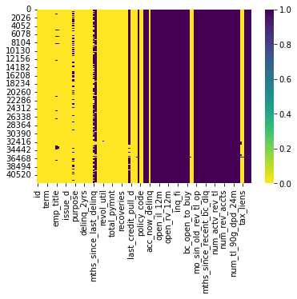
    


#### **Elimination of Variables with 100% Missing Values**


```python
fnulls= (df.isnull().sum().values / df.shape[0])*100
dft= df.dropna( axis=1, thresh=fnulls)
```


```python
dft.shape
```


    (42538, 61)


```python
sns.heatmap(dft.isnull(),cmap="viridis_r")
```


    <AxesSubplot:>


    
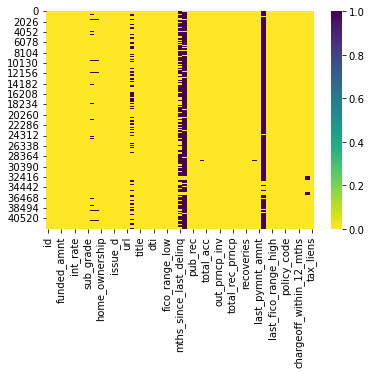
    


```python
nul_calcul(dft)
```


<div>
<style scoped>
    .dataframe tbody tr th:only-of-type {
        vertical-align: middle;
    }

    .dataframe tbody tr th {
        vertical-align: top;
    }

    .dataframe thead th {
        text-align: right;
    }
</style>
<table border="1" class="dataframe">
  <thead>
    <tr style="text-align: right;">
      <th></th>
      <th>Features</th>
      <th>Null values</th>
      <th>% Null values</th>
    </tr>
  </thead>
  <tbody>
    <tr>
      <th>49</th>
      <td>next_pymnt_d</td>
      <td>39242</td>
      <td>92.251634</td>
    </tr>
    <tr>
      <th>31</th>
      <td>mths_since_last_record</td>
      <td>38887</td>
      <td>91.417086</td>
    </tr>
    <tr>
      <th>30</th>
      <td>mths_since_last_delinq</td>
      <td>26929</td>
      <td>63.305750</td>
    </tr>
    <tr>
      <th>19</th>
      <td>desc</td>
      <td>13296</td>
      <td>31.256759</td>
    </tr>
    <tr>
      <th>10</th>
      <td>emp_title</td>
      <td>2629</td>
      <td>6.180356</td>
    </tr>
    <tr>
      <th>59</th>
      <td>pub_rec_bankruptcies</td>
      <td>1368</td>
      <td>3.215948</td>
    </tr>
    <tr>
      <th>11</th>
      <td>emp_length</td>
      <td>1115</td>
      <td>2.621186</td>
    </tr>
    <tr>
      <th>57</th>
      <td>chargeoff_within_12_mths</td>
      <td>148</td>
      <td>0.347924</td>
    </tr>
    <tr>
      <th>53</th>
      <td>collections_12_mths_ex_med</td>
      <td>148</td>
      <td>0.347924</td>
    </tr>
    <tr>
      <th>60</th>
      <td>tax_liens</td>
      <td>108</td>
      <td>0.253891</td>
    </tr>
    <tr>
      <th>35</th>
      <td>revol_util</td>
      <td>93</td>
      <td>0.218628</td>
    </tr>
    <tr>
      <th>47</th>
      <td>last_pymnt_d</td>
      <td>86</td>
      <td>0.202172</td>
    </tr>
    <tr>
      <th>56</th>
      <td>acc_now_delinq</td>
      <td>32</td>
      <td>0.075227</td>
    </tr>
    <tr>
      <th>26</th>
      <td>earliest_cr_line</td>
      <td>32</td>
      <td>0.075227</td>
    </tr>
    <tr>
      <th>25</th>
      <td>delinq_2yrs</td>
      <td>32</td>
      <td>0.075227</td>
    </tr>
    <tr>
      <th>32</th>
      <td>open_acc</td>
      <td>32</td>
      <td>0.075227</td>
    </tr>
    <tr>
      <th>33</th>
      <td>pub_rec</td>
      <td>32</td>
      <td>0.075227</td>
    </tr>
    <tr>
      <th>36</th>
      <td>total_acc</td>
      <td>32</td>
      <td>0.075227</td>
    </tr>
    <tr>
      <th>58</th>
      <td>delinq_amnt</td>
      <td>32</td>
      <td>0.075227</td>
    </tr>
    <tr>
      <th>29</th>
      <td>inq_last_6mths</td>
      <td>32</td>
      <td>0.075227</td>
    </tr>
    <tr>
      <th>21</th>
      <td>title</td>
      <td>16</td>
      <td>0.037613</td>
    </tr>
    <tr>
      <th>50</th>
      <td>last_credit_pull_d</td>
      <td>7</td>
      <td>0.016456</td>
    </tr>
    <tr>
      <th>13</th>
      <td>annual_inc</td>
      <td>7</td>
      <td>0.016456</td>
    </tr>
    <tr>
      <th>43</th>
      <td>total_rec_int</td>
      <td>3</td>
      <td>0.007053</td>
    </tr>
    <tr>
      <th>44</th>
      <td>total_rec_late_fee</td>
      <td>3</td>
      <td>0.007053</td>
    </tr>
    <tr>
      <th>45</th>
      <td>recoveries</td>
      <td>3</td>
      <td>0.007053</td>
    </tr>
    <tr>
      <th>46</th>
      <td>collection_recovery_fee</td>
      <td>3</td>
      <td>0.007053</td>
    </tr>
    <tr>
      <th>42</th>
      <td>total_rec_prncp</td>
      <td>3</td>
      <td>0.007053</td>
    </tr>
    <tr>
      <th>5</th>
      <td>term</td>
      <td>3</td>
      <td>0.007053</td>
    </tr>
    <tr>
      <th>48</th>
      <td>last_pymnt_amnt</td>
      <td>3</td>
      <td>0.007053</td>
    </tr>
    <tr>
      <th>40</th>
      <td>total_pymnt</td>
      <td>3</td>
      <td>0.007053</td>
    </tr>
    <tr>
      <th>51</th>
      <td>last_fico_range_high</td>
      <td>3</td>
      <td>0.007053</td>
    </tr>
    <tr>
      <th>52</th>
      <td>last_fico_range_low</td>
      <td>3</td>
      <td>0.007053</td>
    </tr>
    <tr>
      <th>4</th>
      <td>funded_amnt_inv</td>
      <td>3</td>
      <td>0.007053</td>
    </tr>
    <tr>
      <th>54</th>
      <td>policy_code</td>
      <td>3</td>
      <td>0.007053</td>
    </tr>
    <tr>
      <th>55</th>
      <td>application_type</td>
      <td>3</td>
      <td>0.007053</td>
    </tr>
    <tr>
      <th>3</th>
      <td>funded_amnt</td>
      <td>3</td>
      <td>0.007053</td>
    </tr>
    <tr>
      <th>2</th>
      <td>loan_amnt</td>
      <td>3</td>
      <td>0.007053</td>
    </tr>
    <tr>
      <th>41</th>
      <td>total_pymnt_inv</td>
      <td>3</td>
      <td>0.007053</td>
    </tr>
    <tr>
      <th>9</th>
      <td>sub_grade</td>
      <td>3</td>
      <td>0.007053</td>
    </tr>
    <tr>
      <th>39</th>
      <td>out_prncp_inv</td>
      <td>3</td>
      <td>0.007053</td>
    </tr>
    <tr>
      <th>22</th>
      <td>zip_code</td>
      <td>3</td>
      <td>0.007053</td>
    </tr>
    <tr>
      <th>12</th>
      <td>home_ownership</td>
      <td>3</td>
      <td>0.007053</td>
    </tr>
    <tr>
      <th>14</th>
      <td>verification_status</td>
      <td>3</td>
      <td>0.007053</td>
    </tr>
    <tr>
      <th>15</th>
      <td>issue_d</td>
      <td>3</td>
      <td>0.007053</td>
    </tr>
    <tr>
      <th>16</th>
      <td>loan_status</td>
      <td>3</td>
      <td>0.007053</td>
    </tr>
    <tr>
      <th>17</th>
      <td>pymnt_plan</td>
      <td>3</td>
      <td>0.007053</td>
    </tr>
    <tr>
      <th>18</th>
      <td>url</td>
      <td>3</td>
      <td>0.007053</td>
    </tr>
    <tr>
      <th>7</th>
      <td>installment</td>
      <td>3</td>
      <td>0.007053</td>
    </tr>
    <tr>
      <th>20</th>
      <td>purpose</td>
      <td>3</td>
      <td>0.007053</td>
    </tr>
    <tr>
      <th>23</th>
      <td>addr_state</td>
      <td>3</td>
      <td>0.007053</td>
    </tr>
    <tr>
      <th>38</th>
      <td>out_prncp</td>
      <td>3</td>
      <td>0.007053</td>
    </tr>
    <tr>
      <th>24</th>
      <td>dti</td>
      <td>3</td>
      <td>0.007053</td>
    </tr>
    <tr>
      <th>27</th>
      <td>fico_range_low</td>
      <td>3</td>
      <td>0.007053</td>
    </tr>
    <tr>
      <th>28</th>
      <td>fico_range_high</td>
      <td>3</td>
      <td>0.007053</td>
    </tr>
    <tr>
      <th>1</th>
      <td>member_id</td>
      <td>3</td>
      <td>0.007053</td>
    </tr>
    <tr>
      <th>6</th>
      <td>int_rate</td>
      <td>3</td>
      <td>0.007053</td>
    </tr>
    <tr>
      <th>34</th>
      <td>revol_bal</td>
      <td>3</td>
      <td>0.007053</td>
    </tr>
    <tr>
      <th>8</th>
      <td>grade</td>
      <td>3</td>
      <td>0.007053</td>
    </tr>
    <tr>
      <th>37</th>
      <td>initial_list_status</td>
      <td>3</td>
      <td>0.007053</td>
    </tr>
    <tr>
      <th>0</th>
      <td>id</td>
      <td>0</td>
      <td>0.000000</td>
    </tr>
  </tbody>
</table>
</div>


#### **Tha leaves us with 61 variables from 115  that means  54 variables are deleted**

### Importing Dictionnary of variables for better understanding 

#### loading just non null variables from dft 


```python
dft.columns
```


    Index(['id', 'member_id', 'loan_amnt', 'funded_amnt', 'funded_amnt_inv',
           'term', 'int_rate', 'installment', 'grade', 'sub_grade', 'emp_title',
           'emp_length', 'home_ownership', 'annual_inc', 'verification_status',
           'issue_d', 'loan_status', 'pymnt_plan', 'url', 'desc', 'purpose',
           'title', 'zip_code', 'addr_state', 'dti', 'delinq_2yrs',
           'earliest_cr_line', 'fico_range_low', 'fico_range_high',
           'inq_last_6mths', 'mths_since_last_delinq', 'mths_since_last_record',
           'open_acc', 'pub_rec', 'revol_bal', 'revol_util', 'total_acc',
           'initial_list_status', 'out_prncp', 'out_prncp_inv', 'total_pymnt',
           'total_pymnt_inv', 'total_rec_prncp', 'total_rec_int',
           'total_rec_late_fee', 'recoveries', 'collection_recovery_fee',
           'last_pymnt_d', 'last_pymnt_amnt', 'next_pymnt_d', 'last_credit_pull_d',
           'last_fico_range_high', 'last_fico_range_low',
           'collections_12_mths_ex_med', 'policy_code', 'application_type',
           'acc_now_delinq', 'chargeoff_within_12_mths', 'delinq_amnt',
           'pub_rec_bankruptcies', 'tax_liens'],
          dtype='object')


```python
dsf=pd.set_option('display.max_colwidth', None)
dsf = pd.read_csv('LCDataDictionary.csv',sep=',')
dsf.set_index("LoanStatNew", inplace=True)
dfd=dsf.loc[['id', 'member_id', 'loan_amnt', 'funded_amnt', 'funded_amnt_inv',
       'term', 'int_rate', 'installment', 'grade', 'sub_grade', 'emp_title',
       'emp_length', 'home_ownership', 'annual_inc', 'verification_status',
       'issue_d', 'loan_status', 'pymnt_plan', 'url', 'desc', 'purpose',
       'title', 'zip_code', 'addr_state', 'dti', 'delinq_2yrs',
       'earliest_cr_line', 'fico_range_low', 'fico_range_high',
       'inq_last_6mths', 'mths_since_last_delinq', 'mths_since_last_record',
       'open_acc', 'pub_rec', 'revol_bal', 'revol_util', 'total_acc',
       'initial_list_status', 'out_prncp', 'out_prncp_inv', 'total_pymnt',
       'total_pymnt_inv', 'total_rec_prncp', 'total_rec_int',
       'total_rec_late_fee', 'recoveries', 'collection_recovery_fee',
       'last_pymnt_d', 'last_pymnt_amnt', 'next_pymnt_d', 'last_credit_pull_d',
       'last_fico_range_high', 'last_fico_range_low',
       'collections_12_mths_ex_med', 'policy_code', 'application_type',
       'acc_now_delinq', 'chargeoff_within_12_mths', 'delinq_amnt',
       'pub_rec_bankruptcies', 'tax_liens']]
```

#### loading the dictionnary partially in a df called dsf with non null columns


```python
#studying Variables and their usefulness for the model
dfd[:18]
```


<div>
<style scoped>
    .dataframe tbody tr th:only-of-type {
        vertical-align: middle;
    }

    .dataframe tbody tr th {
        vertical-align: top;
    }

    .dataframe thead th {
        text-align: right;
    }
</style>
<table border="1" class="dataframe">
  <thead>
    <tr style="text-align: right;">
      <th></th>
      <th>Description</th>
    </tr>
    <tr>
      <th>LoanStatNew</th>
      <th></th>
    </tr>
  </thead>
  <tbody>
    <tr>
      <th>id</th>
      <td>A unique LC assigned ID for the loan listing.</td>
    </tr>
    <tr>
      <th>member_id</th>
      <td>A unique LC assigned Id for the borrower member.</td>
    </tr>
    <tr>
      <th>loan_amnt</th>
      <td>The listed amount of the loan applied for by the borrower. If at some point in time, the credit department reduces the loan amount, then it will be reflected in this value.</td>
    </tr>
    <tr>
      <th>funded_amnt</th>
      <td>The total amount committed to that loan at that point in time.</td>
    </tr>
    <tr>
      <th>funded_amnt_inv</th>
      <td>The total amount committed by investors for that loan at that point in time.</td>
    </tr>
    <tr>
      <th>term</th>
      <td>The number of payments on the loan. Values are in months and can be either 36 or 60.</td>
    </tr>
    <tr>
      <th>int_rate</th>
      <td>Interest Rate on the loan</td>
    </tr>
    <tr>
      <th>installment</th>
      <td>The monthly payment owed by the borrower if the loan originates.</td>
    </tr>
    <tr>
      <th>grade</th>
      <td>LC assigned loan grade</td>
    </tr>
    <tr>
      <th>sub_grade</th>
      <td>LC assigned loan subgrade</td>
    </tr>
    <tr>
      <th>emp_title</th>
      <td>The job title supplied by the Borrower when applying for the loan.*</td>
    </tr>
    <tr>
      <th>emp_length</th>
      <td>Employment length in years. Possible values are between 0 and 10 where 0 means less than one year and 10 means ten or more years.</td>
    </tr>
    <tr>
      <th>home_ownership</th>
      <td>The home ownership status provided by the borrower during registration. Our values are: RENT, OWN, MORTGAGE, OTHER.</td>
    </tr>
    <tr>
      <th>annual_inc</th>
      <td>The self-reported annual income provided by the borrower during registration.</td>
    </tr>
    <tr>
      <th>verification_status</th>
      <td>Indicates if income was verified by LC, not verified, or if the income source was verified</td>
    </tr>
    <tr>
      <th>issue_d</th>
      <td>The month which the loan was funded</td>
    </tr>
    <tr>
      <th>loan_status</th>
      <td>Current status of the loan</td>
    </tr>
    <tr>
      <th>pymnt_plan</th>
      <td>Indicates if a payment plan has been put in place for the loan</td>
    </tr>
  </tbody>
</table>
</div>


* id : for the sake of the model and their prediction usualy we wont have an ID or memeber_id 
* sub_grade : has   info thats already been in garde and  redundant variables removing ==> sub_Grade 
* funded_amnt : we  its the same as loan amount no need to keep both
* funded_amnt_inv :its the same as loan amount no need to keep both
* sub_grade : we already have more information on grade no need to keep both
* emp_title — has 2629 null values
* issue_d: date variable I need to keep the columns to a minimum so I can deploy easily
* pymnt_plan no need to keep since all the values are false and 1 is true


```python
df['home_ownership'].value_counts()
```


    RENT        20181
    MORTGAGE    18959
    OWN          3251
    OTHER         136
    NONE            8
    Name: home_ownership, dtype: int64


#### removing columns above


```python
drop_list = ['id','member_id','funded_amnt','funded_amnt_inv','sub_grade','emp_title','pymnt_plan','issue_d']
dft= dft.drop(drop_list,axis=1)
```

#### Second Group Of Columns

#### move on to the next 18 columns:


```python
dfd[18:37]
```


<div>
<style scoped>
    .dataframe tbody tr th:only-of-type {
        vertical-align: middle;
    }

    .dataframe tbody tr th {
        vertical-align: top;
    }

    .dataframe thead th {
        text-align: right;
    }
</style>
<table border="1" class="dataframe">
  <thead>
    <tr style="text-align: right;">
      <th></th>
      <th>Description</th>
    </tr>
    <tr>
      <th>LoanStatNew</th>
      <th></th>
    </tr>
  </thead>
  <tbody>
    <tr>
      <th>url</th>
      <td>URL for the LC page with listing data.</td>
    </tr>
    <tr>
      <th>desc</th>
      <td>Loan description provided by the borrower</td>
    </tr>
    <tr>
      <th>purpose</th>
      <td>A category provided by the borrower for the loan request.</td>
    </tr>
    <tr>
      <th>title</th>
      <td>The loan title provided by the borrower</td>
    </tr>
    <tr>
      <th>zip_code</th>
      <td>The first 3 numbers of the zip code provided by the borrower in the loan application.</td>
    </tr>
    <tr>
      <th>addr_state</th>
      <td>The state provided by the borrower in the loan application</td>
    </tr>
    <tr>
      <th>dti</th>
      <td>A ratio calculated using the borrower’s total monthly debt payments on the total debt obligations, excluding mortgage and the requested LC loan, divided by the borrower’s self-reported monthly income.</td>
    </tr>
    <tr>
      <th>delinq_2yrs</th>
      <td>The number of 30+ days past-due incidences of delinquency in the borrower's credit file for the past 2 years</td>
    </tr>
    <tr>
      <th>earliest_cr_line</th>
      <td>The month the borrower's earliest reported credit line was opened</td>
    </tr>
    <tr>
      <th>fico_range_low</th>
      <td>The lower boundary range the borrower’s FICO at loan origination belongs to.</td>
    </tr>
    <tr>
      <th>fico_range_high</th>
      <td>The upper boundary range the borrower’s FICO at loan origination belongs to.</td>
    </tr>
    <tr>
      <th>inq_last_6mths</th>
      <td>The number of inquiries in past 6 months (excluding auto and mortgage inquiries)</td>
    </tr>
    <tr>
      <th>mths_since_last_delinq</th>
      <td>The number of months since the borrower's last delinquency.</td>
    </tr>
    <tr>
      <th>mths_since_last_record</th>
      <td>The number of months since the last public record.</td>
    </tr>
    <tr>
      <th>open_acc</th>
      <td>The number of open credit lines in the borrower's credit file.</td>
    </tr>
    <tr>
      <th>pub_rec</th>
      <td>Number of derogatory public records</td>
    </tr>
    <tr>
      <th>revol_bal</th>
      <td>Total credit revolving balance</td>
    </tr>
    <tr>
      <th>revol_util</th>
      <td>Revolving line utilization rate, or the amount of credit the borrower is using relative to all available revolving credit.</td>
    </tr>
    <tr>
      <th>total_acc</th>
      <td>The total number of credit lines currently in the borrower's credit file</td>
    </tr>
  </tbody>
</table>
</div>


* url : categorical variale link not suitable to be encoded
* desc: 13296 missing values not usful needs alot of processing
* title : not helping too much categorical values not fitting to be encoded
* zip_code : not fitting to be in dataset since we are interested in likelihood of a borrower reimbursing his dept
* earliest_cr_line : date variable no need to keep it
* inq_last_6mths : 30 missing vaues
* addr_state :  the same logic apply for zip code1
* delinq_2yrs: almost all of the values are 0s
* mths_since_last_delinq : 26929 missing values
* mths_since_last_record : 38887 missing values
* open_acc:  30 missing values
* pub_rec : 30 missing vaues
* revol_bal:the info already in revol_util no need to keep both

#### removing columns above


```python
drop_list2 = ['url','desc','title','zip_code','earliest_cr_line','inq_last_6mths','addr_state','delinq_2yrs'
              ,'mths_since_last_delinq','mths_since_last_record','open_acc','pub_rec','revol_bal']
dft= dft.drop(drop_list2,axis=1)
```

#### Third Group Of Columns

#### move on to the rest of the columns:


```python
dfd[37:]
```


<div>
<style scoped>
    .dataframe tbody tr th:only-of-type {
        vertical-align: middle;
    }

    .dataframe tbody tr th {
        vertical-align: top;
    }

    .dataframe thead th {
        text-align: right;
    }
</style>
<table border="1" class="dataframe">
  <thead>
    <tr style="text-align: right;">
      <th></th>
      <th>Description</th>
    </tr>
    <tr>
      <th>LoanStatNew</th>
      <th></th>
    </tr>
  </thead>
  <tbody>
    <tr>
      <th>initial_list_status</th>
      <td>The initial listing status of the loan. Possible values are – W, F</td>
    </tr>
    <tr>
      <th>out_prncp</th>
      <td>Remaining outstanding principal for total amount funded</td>
    </tr>
    <tr>
      <th>out_prncp_inv</th>
      <td>Remaining outstanding principal for portion of total amount funded by investors</td>
    </tr>
    <tr>
      <th>total_pymnt</th>
      <td>Payments received to date for total amount funded</td>
    </tr>
    <tr>
      <th>total_pymnt_inv</th>
      <td>Payments received to date for portion of total amount funded by investors</td>
    </tr>
    <tr>
      <th>total_rec_prncp</th>
      <td>Principal received to date</td>
    </tr>
    <tr>
      <th>total_rec_int</th>
      <td>Interest received to date</td>
    </tr>
    <tr>
      <th>total_rec_late_fee</th>
      <td>Late fees received to date</td>
    </tr>
    <tr>
      <th>recoveries</th>
      <td>post charge off gross recovery</td>
    </tr>
    <tr>
      <th>collection_recovery_fee</th>
      <td>post charge off collection fee</td>
    </tr>
    <tr>
      <th>last_pymnt_d</th>
      <td>Last month payment was received</td>
    </tr>
    <tr>
      <th>last_pymnt_amnt</th>
      <td>Last total payment amount received</td>
    </tr>
    <tr>
      <th>next_pymnt_d</th>
      <td>Next scheduled payment date</td>
    </tr>
    <tr>
      <th>last_credit_pull_d</th>
      <td>The most recent month LC pulled credit for this loan</td>
    </tr>
    <tr>
      <th>last_fico_range_high</th>
      <td>The upper boundary range the borrower’s last FICO pulled belongs to.</td>
    </tr>
    <tr>
      <th>last_fico_range_low</th>
      <td>The lower boundary range the borrower’s last FICO pulled belongs to.</td>
    </tr>
    <tr>
      <th>collections_12_mths_ex_med</th>
      <td>Number of collections in 12 months excluding medical collections</td>
    </tr>
    <tr>
      <th>policy_code</th>
      <td>publicly available policy_code=1\nnew products not publicly available policy_code=2</td>
    </tr>
    <tr>
      <th>application_type</th>
      <td>Indicates whether the loan is an individual application or a joint application with two co-borrowers</td>
    </tr>
    <tr>
      <th>acc_now_delinq</th>
      <td>The number of accounts on which the borrower is now delinquent.</td>
    </tr>
    <tr>
      <th>chargeoff_within_12_mths</th>
      <td>Number of charge-offs within 12 months</td>
    </tr>
    <tr>
      <th>delinq_amnt</th>
      <td>The past-due amount owed for the accounts on which the borrower is now delinquent.</td>
    </tr>
    <tr>
      <th>pub_rec_bankruptcies</th>
      <td>Number of public record bankruptcies</td>
    </tr>
    <tr>
      <th>tax_liens</th>
      <td>Number of tax liens</td>
    </tr>
  </tbody>
</table>
</div>


* initial_list_status : has one value == false
* out_prncp : we only need loan amounrt and the monthly instalment
* out_prncp_inv: we only need loan amounrt and the monthly instalment
* total_pymnt_inv:we only need loan amounrt and the monthly instalment
* total_rec_prncp: we have the instalment column
* total_rec_int: keeping the varibales to a minimum
* total_rec_late_fee:keeping the varibales to a minimum
* home_ownership: date variable no need to keep it
* collection_recovery_fee we already have recoveries column
* next_pymnt_d : not usful for the model prediction  39242 missing value
* last_pymnt_amnt : we can keep recoveries no need for last payement
* last_credit_pull_d: date variable no need to keep it
* last_credit_pull_d : date variable no need to keep it
* collections_12_mths_ex_med : Number of collections in 12 months excluding medical collections with 148 missing values plus all false
* application_type : hase one value of individual
* policy_code : not helping in prediction
* acc_now_delinq :we have delinq_2yrs columns
* chargeoff_within_12_mths : Number of charge-offs within 12 months 148 missing values 
* delinq_amnt : all values equal 0 no need to keep it
* pub_rec_bankruptcies : 	Number of public record bankruptcies with 1368 missing data plus all data are fals
* tax_liens : too muche false value the same value is repeated no need to keep it

#### removing columns above


```python
drop_cols3 = ['initial_list_status','out_prncp','out_prncp_inv','total_pymnt_inv','total_rec_prncp'
              ,'total_rec_int','total_rec_late_fee','collection_recovery_fee','last_credit_pull_d','last_pymnt_d',
              'next_pymnt_d','last_pymnt_amnt','collections_12_mths_ex_med','application_type','policy_code'
              ,'chargeoff_within_12_mths','acc_now_delinq','delinq_amnt','pub_rec_bankruptcies','tax_liens']
dft = dft.drop(drop_cols3, axis=1)
```


```python
dft.shape
```


    (42538, 20)


```python
nul_calcul(dft)
```


<div>
<style scoped>
    .dataframe tbody tr th:only-of-type {
        vertical-align: middle;
    }

    .dataframe tbody tr th {
        vertical-align: top;
    }

    .dataframe thead th {
        text-align: right;
    }
</style>
<table border="1" class="dataframe">
  <thead>
    <tr style="text-align: right;">
      <th></th>
      <th>Features</th>
      <th>Null values</th>
      <th>% Null values</th>
    </tr>
  </thead>
  <tbody>
    <tr>
      <th>5</th>
      <td>emp_length</td>
      <td>1115</td>
      <td>2.621186</td>
    </tr>
    <tr>
      <th>14</th>
      <td>revol_util</td>
      <td>93</td>
      <td>0.218628</td>
    </tr>
    <tr>
      <th>15</th>
      <td>total_acc</td>
      <td>32</td>
      <td>0.075227</td>
    </tr>
    <tr>
      <th>7</th>
      <td>annual_inc</td>
      <td>7</td>
      <td>0.016456</td>
    </tr>
    <tr>
      <th>0</th>
      <td>loan_amnt</td>
      <td>3</td>
      <td>0.007053</td>
    </tr>
    <tr>
      <th>11</th>
      <td>dti</td>
      <td>3</td>
      <td>0.007053</td>
    </tr>
    <tr>
      <th>18</th>
      <td>last_fico_range_high</td>
      <td>3</td>
      <td>0.007053</td>
    </tr>
    <tr>
      <th>17</th>
      <td>recoveries</td>
      <td>3</td>
      <td>0.007053</td>
    </tr>
    <tr>
      <th>16</th>
      <td>total_pymnt</td>
      <td>3</td>
      <td>0.007053</td>
    </tr>
    <tr>
      <th>13</th>
      <td>fico_range_high</td>
      <td>3</td>
      <td>0.007053</td>
    </tr>
    <tr>
      <th>12</th>
      <td>fico_range_low</td>
      <td>3</td>
      <td>0.007053</td>
    </tr>
    <tr>
      <th>10</th>
      <td>purpose</td>
      <td>3</td>
      <td>0.007053</td>
    </tr>
    <tr>
      <th>1</th>
      <td>term</td>
      <td>3</td>
      <td>0.007053</td>
    </tr>
    <tr>
      <th>9</th>
      <td>loan_status</td>
      <td>3</td>
      <td>0.007053</td>
    </tr>
    <tr>
      <th>8</th>
      <td>verification_status</td>
      <td>3</td>
      <td>0.007053</td>
    </tr>
    <tr>
      <th>6</th>
      <td>home_ownership</td>
      <td>3</td>
      <td>0.007053</td>
    </tr>
    <tr>
      <th>4</th>
      <td>grade</td>
      <td>3</td>
      <td>0.007053</td>
    </tr>
    <tr>
      <th>3</th>
      <td>installment</td>
      <td>3</td>
      <td>0.007053</td>
    </tr>
    <tr>
      <th>2</th>
      <td>int_rate</td>
      <td>3</td>
      <td>0.007053</td>
    </tr>
    <tr>
      <th>19</th>
      <td>last_fico_range_low</td>
      <td>3</td>
      <td>0.007053</td>
    </tr>
  </tbody>
</table>
</div>


```python
pd.set_option('display.max_rows', None)
emp_length_null=dft[dft['emp_length'].isnull()]
emp_length_null[['emp_length', 'loan_status']].value_counts('loan_status')
```


    loan_status
    Fully Paid                                             827
    Charged Off                                            230
    Current                                                 19
    Does not meet the credit policy. Status:Fully Paid      19
    Does not meet the credit policy. Status:Charged Off     15
    In Grace Period                                          1
    Late (16-30 days)                                        1
    dtype: int64


#### removing null rows of the column emp_length


```python
dft.dropna(subset=['emp_length'], how='all', inplace=True)
```


```python
dft['emp_length'].value_counts()
```


    10+ years    9369
    < 1 year     5062
    2 years      4743
    3 years      4364
    4 years      3649
    1 year       3595
    5 years      3458
    6 years      2375
    7 years      1875
    8 years      1592
    9 years      1341
    Name: emp_length, dtype: int64


#### filling null vlues of the revol_util  with the mean


```python
revol_mean=dft['revol_util'].mean()
dft['revol_util']=dft['revol_util'].fillna(revol_mean)
```


```python
nul_calcul(dft)
```


<div>
<style scoped>
    .dataframe tbody tr th:only-of-type {
        vertical-align: middle;
    }

    .dataframe tbody tr th {
        vertical-align: top;
    }

    .dataframe thead th {
        text-align: right;
    }
</style>
<table border="1" class="dataframe">
  <thead>
    <tr style="text-align: right;">
      <th></th>
      <th>Features</th>
      <th>Null values</th>
      <th>% Null values</th>
    </tr>
  </thead>
  <tbody>
    <tr>
      <th>15</th>
      <td>total_acc</td>
      <td>29</td>
      <td>0.070009</td>
    </tr>
    <tr>
      <th>7</th>
      <td>annual_inc</td>
      <td>4</td>
      <td>0.009656</td>
    </tr>
    <tr>
      <th>0</th>
      <td>loan_amnt</td>
      <td>0</td>
      <td>0.000000</td>
    </tr>
    <tr>
      <th>11</th>
      <td>dti</td>
      <td>0</td>
      <td>0.000000</td>
    </tr>
    <tr>
      <th>18</th>
      <td>last_fico_range_high</td>
      <td>0</td>
      <td>0.000000</td>
    </tr>
    <tr>
      <th>17</th>
      <td>recoveries</td>
      <td>0</td>
      <td>0.000000</td>
    </tr>
    <tr>
      <th>16</th>
      <td>total_pymnt</td>
      <td>0</td>
      <td>0.000000</td>
    </tr>
    <tr>
      <th>14</th>
      <td>revol_util</td>
      <td>0</td>
      <td>0.000000</td>
    </tr>
    <tr>
      <th>13</th>
      <td>fico_range_high</td>
      <td>0</td>
      <td>0.000000</td>
    </tr>
    <tr>
      <th>12</th>
      <td>fico_range_low</td>
      <td>0</td>
      <td>0.000000</td>
    </tr>
    <tr>
      <th>10</th>
      <td>purpose</td>
      <td>0</td>
      <td>0.000000</td>
    </tr>
    <tr>
      <th>1</th>
      <td>term</td>
      <td>0</td>
      <td>0.000000</td>
    </tr>
    <tr>
      <th>9</th>
      <td>loan_status</td>
      <td>0</td>
      <td>0.000000</td>
    </tr>
    <tr>
      <th>8</th>
      <td>verification_status</td>
      <td>0</td>
      <td>0.000000</td>
    </tr>
    <tr>
      <th>6</th>
      <td>home_ownership</td>
      <td>0</td>
      <td>0.000000</td>
    </tr>
    <tr>
      <th>5</th>
      <td>emp_length</td>
      <td>0</td>
      <td>0.000000</td>
    </tr>
    <tr>
      <th>4</th>
      <td>grade</td>
      <td>0</td>
      <td>0.000000</td>
    </tr>
    <tr>
      <th>3</th>
      <td>installment</td>
      <td>0</td>
      <td>0.000000</td>
    </tr>
    <tr>
      <th>2</th>
      <td>int_rate</td>
      <td>0</td>
      <td>0.000000</td>
    </tr>
    <tr>
      <th>19</th>
      <td>last_fico_range_low</td>
      <td>0</td>
      <td>0.000000</td>
    </tr>
  </tbody>
</table>
</div>


#### **This method fills each missing row with the value of the nearest one above it**


```python
dft.fillna(method='ffill', inplace=True)
```


```python
nul_calcul(dft)
```


<div>
<style scoped>
    .dataframe tbody tr th:only-of-type {
        vertical-align: middle;
    }

    .dataframe tbody tr th {
        vertical-align: top;
    }

    .dataframe thead th {
        text-align: right;
    }
</style>
<table border="1" class="dataframe">
  <thead>
    <tr style="text-align: right;">
      <th></th>
      <th>Features</th>
      <th>Null values</th>
      <th>% Null values</th>
    </tr>
  </thead>
  <tbody>
    <tr>
      <th>0</th>
      <td>loan_amnt</td>
      <td>0</td>
      <td>0.0</td>
    </tr>
    <tr>
      <th>1</th>
      <td>term</td>
      <td>0</td>
      <td>0.0</td>
    </tr>
    <tr>
      <th>18</th>
      <td>last_fico_range_high</td>
      <td>0</td>
      <td>0.0</td>
    </tr>
    <tr>
      <th>17</th>
      <td>recoveries</td>
      <td>0</td>
      <td>0.0</td>
    </tr>
    <tr>
      <th>16</th>
      <td>total_pymnt</td>
      <td>0</td>
      <td>0.0</td>
    </tr>
    <tr>
      <th>15</th>
      <td>total_acc</td>
      <td>0</td>
      <td>0.0</td>
    </tr>
    <tr>
      <th>14</th>
      <td>revol_util</td>
      <td>0</td>
      <td>0.0</td>
    </tr>
    <tr>
      <th>13</th>
      <td>fico_range_high</td>
      <td>0</td>
      <td>0.0</td>
    </tr>
    <tr>
      <th>12</th>
      <td>fico_range_low</td>
      <td>0</td>
      <td>0.0</td>
    </tr>
    <tr>
      <th>11</th>
      <td>dti</td>
      <td>0</td>
      <td>0.0</td>
    </tr>
    <tr>
      <th>10</th>
      <td>purpose</td>
      <td>0</td>
      <td>0.0</td>
    </tr>
    <tr>
      <th>9</th>
      <td>loan_status</td>
      <td>0</td>
      <td>0.0</td>
    </tr>
    <tr>
      <th>8</th>
      <td>verification_status</td>
      <td>0</td>
      <td>0.0</td>
    </tr>
    <tr>
      <th>7</th>
      <td>annual_inc</td>
      <td>0</td>
      <td>0.0</td>
    </tr>
    <tr>
      <th>6</th>
      <td>home_ownership</td>
      <td>0</td>
      <td>0.0</td>
    </tr>
    <tr>
      <th>5</th>
      <td>emp_length</td>
      <td>0</td>
      <td>0.0</td>
    </tr>
    <tr>
      <th>4</th>
      <td>grade</td>
      <td>0</td>
      <td>0.0</td>
    </tr>
    <tr>
      <th>3</th>
      <td>installment</td>
      <td>0</td>
      <td>0.0</td>
    </tr>
    <tr>
      <th>2</th>
      <td>int_rate</td>
      <td>0</td>
      <td>0.0</td>
    </tr>
    <tr>
      <th>19</th>
      <td>last_fico_range_low</td>
      <td>0</td>
      <td>0.0</td>
    </tr>
  </tbody>
</table>
</div>


```python
sns.heatmap(dft.isnull(),cmap="viridis_r")
```


    <AxesSubplot:>


    
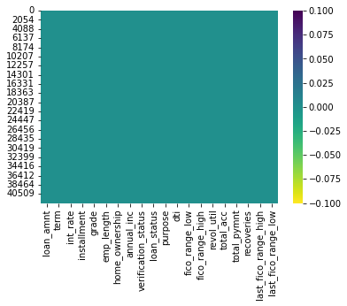
    


```python
dft = dft.dropna(how='all')
```

#### it seems now that we have data frame withou null values


```python
dft.shape
```


    (41423, 20)


```python
#Shape of dataframe
print('Number of rows   :',dft.shape[0])
print('Number of columns:',dft.shape[1])
```

    Number of rows   : 41423
    Number of columns: 20
    

## **Features Engineering**

#### **The variable verification status has 3 values 'verified', 'source verified', and 'not verified' source verified and verified mean the same thing so I transform 'source verified' to verified and proceed to label encoding**


```python
dft["verification_status"].value_counts()
```


    Not Verified       18313
    Verified           13004
    Source Verified    10106
    Name: verification_status, dtype: int64


```python
dft["verification_status"].replace({"Source Verified":'Verified'}, inplace=True)
```


```python
from sklearn import preprocessing
  
# label_encoder object knows how to understand word labels.
label_enc_vs = preprocessing.LabelEncoder()
  
# Encode labels in column 'species'.
dft['verification_status']= label_enc_vs.fit_transform(dft['verification_status'])
  
dft['verification_status'].unique()
```


    array([1, 0])


#### **The variable home_ownership has alot of values and possibly good for prediction so it'll be wise to encode it


```python
# Encode labels in column 'species'.
dft['home_ownership']= label_enc_vs.fit_transform(dft['home_ownership'])
  
dft['home_ownership'].unique()
```


    array([4, 3, 0, 2, 1])


#### **The variable emp_length has 11 values I have encoded it ordinaly by experience**


```python
dft["emp_length"].value_counts()
```


    10+ years    9369
    < 1 year     5062
    2 years      4743
    3 years      4364
    4 years      3649
    1 year       3595
    5 years      3458
    6 years      2375
    7 years      1875
    8 years      1592
    9 years      1341
    Name: emp_length, dtype: int64


```python
dft["emp_length"].replace({"< 1 year":0 ,"1 year":1,"2 years":2,"3 years":3,"4 years":4,"5 years":5,
                          "6 years":6,"7 years":7,"8 years":8,"9 years":9,"10+ years":10}, inplace=True)
dft['emp_length'].unique()
```


    array([10,  0,  5,  2,  4,  3,  9,  1,  6,  7,  8], dtype=int64)


#### **checking the correlation between 'fico_range_high' and 'fico_range_low' 


```python
sns.regplot(x=dft["fico_range_low"], y=dft["fico_range_high"])
```


    <AxesSubplot:xlabel='fico_range_low', ylabel='fico_range_high'>


    
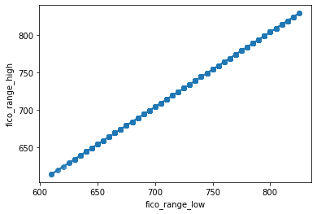
    


#### we can see clearly that the two variables are linear no need to keep both of them, will generate mean columns out of them

#### calculating the mean of the two variables and drop them afterwards


```python
dft['fico_score']=dft[['fico_range_low', 'fico_range_high']].mean(axis=1)
```


```python
dft=dft.drop(['fico_range_low','fico_range_high'],axis=1)
```

#### **checking the correlation between tast_fico_range_low and last_fico_range_high**


```python
dft[["last_fico_range_high","last_fico_range_low"]].corr()
```


<div>
<style scoped>
    .dataframe tbody tr th:only-of-type {
        vertical-align: middle;
    }

    .dataframe tbody tr th {
        vertical-align: top;
    }

    .dataframe thead th {
        text-align: right;
    }
</style>
<table border="1" class="dataframe">
  <thead>
    <tr style="text-align: right;">
      <th></th>
      <th>last_fico_range_high</th>
      <th>last_fico_range_low</th>
    </tr>
  </thead>
  <tbody>
    <tr>
      <th>last_fico_range_high</th>
      <td>1.000000</td>
      <td>0.851592</td>
    </tr>
    <tr>
      <th>last_fico_range_low</th>
      <td>0.851592</td>
      <td>1.000000</td>
    </tr>
  </tbody>
</table>
</div>


```python
sns.regplot(x=dft["last_fico_range_high"], y=dft["last_fico_range_low"])
```


    <AxesSubplot:xlabel='last_fico_range_high', ylabel='last_fico_range_low'>


    
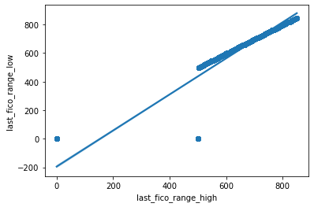
    


```python
dft=dft.drop(['last_fico_range_high','last_fico_range_low'],axis=1)
```

#### since we already have a fico score column no need to keep the late score,I ll remove both of them

#### **The variable sub_Grade takes an ordinal shape from A to G the ordinal encoding is fitting in this case**


```python
# Import label encoder
from sklearn import preprocessing
  
# label_encoder object knows how to understand word labels.
label_encoder = preprocessing.LabelEncoder()
  
# Encode labels in column 'species'.
dft['grade']= label_encoder.fit_transform(dft['grade'])
  
dft['grade'].unique()
```


    array([1, 2, 0, 3, 4, 6, 5])


#### **The purpose variable has alot of values I took the unique variables and split them into to 2 categories personal and investment so that in encoding dont give us alot variable**


```python
dft["purpose"].replace({"debt_consolidation":"personal" ,"credit_card":"personal","other":"personal",
                        "home_improvement":"investement","major_purchase":"investement","small_business":"investement",
                          "car":"investement","wedding":"personal","medical":"personal","moving":"investement","house":"investement","educational":"investement",
                       "vacation":"investement","vacation":"investement","renewable_energy":"investement"}, inplace=True)
```


```python
dft['purpose']= label_encoder.fit_transform(dft['purpose'])
  
dft['purpose'].unique()
```


    array([1, 0])


#### Replace the two terms with their corresponding number for the sake of model understanding


```python
dft["term"].replace({" 36 months":36 ," 60 months":60}, inplace=True)
dft['term'].unique()
```


    array([36, 60], dtype=int64)


```python
dft['loan_status'].unique()
```


    array(['Fully Paid', 'Charged Off', 'Current', 'Late (31-120 days)',
           'In Grace Period', 'Default', 'Late (16-30 days)',
           'Does not meet the credit policy. Status:Fully Paid',
           'Does not meet the credit policy. Status:Charged Off'],
          dtype=object)


#### I replace other values like 'current' and 'Does Not.... Status:Fully Paid' with Fully Paid and Late values with charged of so we can have a two class problem of classification


```python
dft["loan_status"].replace({"Default":"Fully Paid" ,"Current":"Fully Paid","In Grace Period":"Fully Paid",
                     "Late (16-30 days)":"Charged Off","Does not meet the credit policy. Status:Fully Paid":"Fully Paid",
                    "Does not meet the credit policy. Status:Charged Off":"Charged Off",
                           "Late (31-120 days)":"Charged Off"}, inplace=True)
dft['loan_status'].unique()
```


    array(['Fully Paid', 'Charged Off'], dtype=object)


```python
dft['loan_status']= label_encoder.fit_transform(dft['loan_status'])
dft['loan_status'].unique()
```


    array([1, 0])


```python
pd.set_option('display.max_columns', None)
dft.head()
```


<div>
<style scoped>
    .dataframe tbody tr th:only-of-type {
        vertical-align: middle;
    }

    .dataframe tbody tr th {
        vertical-align: top;
    }

    .dataframe thead th {
        text-align: right;
    }
</style>
<table border="1" class="dataframe">
  <thead>
    <tr style="text-align: right;">
      <th></th>
      <th>loan_amnt</th>
      <th>term</th>
      <th>int_rate</th>
      <th>installment</th>
      <th>grade</th>
      <th>emp_length</th>
      <th>home_ownership</th>
      <th>annual_inc</th>
      <th>verification_status</th>
      <th>loan_status</th>
      <th>purpose</th>
      <th>dti</th>
      <th>revol_util</th>
      <th>total_acc</th>
      <th>total_pymnt</th>
      <th>recoveries</th>
      <th>fico_score</th>
    </tr>
  </thead>
  <tbody>
    <tr>
      <th>0</th>
      <td>5000.0</td>
      <td>36</td>
      <td>0.1065</td>
      <td>162.87</td>
      <td>1</td>
      <td>10</td>
      <td>4</td>
      <td>24000.0</td>
      <td>1</td>
      <td>1</td>
      <td>1</td>
      <td>27.65</td>
      <td>0.837</td>
      <td>9.0</td>
      <td>5863.155187</td>
      <td>0.00</td>
      <td>737.0</td>
    </tr>
    <tr>
      <th>1</th>
      <td>2500.0</td>
      <td>60</td>
      <td>0.1527</td>
      <td>59.83</td>
      <td>2</td>
      <td>0</td>
      <td>4</td>
      <td>30000.0</td>
      <td>1</td>
      <td>0</td>
      <td>0</td>
      <td>1.00</td>
      <td>0.094</td>
      <td>4.0</td>
      <td>1008.710000</td>
      <td>117.08</td>
      <td>742.0</td>
    </tr>
    <tr>
      <th>2</th>
      <td>6500.0</td>
      <td>60</td>
      <td>0.1465</td>
      <td>153.45</td>
      <td>2</td>
      <td>5</td>
      <td>3</td>
      <td>72000.0</td>
      <td>0</td>
      <td>1</td>
      <td>1</td>
      <td>16.12</td>
      <td>0.206</td>
      <td>23.0</td>
      <td>7678.017673</td>
      <td>0.00</td>
      <td>697.0</td>
    </tr>
    <tr>
      <th>3</th>
      <td>6200.0</td>
      <td>36</td>
      <td>0.0991</td>
      <td>199.80</td>
      <td>1</td>
      <td>2</td>
      <td>4</td>
      <td>25000.0</td>
      <td>0</td>
      <td>0</td>
      <td>1</td>
      <td>20.64</td>
      <td>0.477</td>
      <td>12.0</td>
      <td>2452.220000</td>
      <td>258.27</td>
      <td>712.0</td>
    </tr>
    <tr>
      <th>4</th>
      <td>14000.0</td>
      <td>36</td>
      <td>0.1427</td>
      <td>480.33</td>
      <td>2</td>
      <td>0</td>
      <td>4</td>
      <td>35000.0</td>
      <td>1</td>
      <td>1</td>
      <td>1</td>
      <td>8.40</td>
      <td>0.657</td>
      <td>30.0</td>
      <td>16745.801430</td>
      <td>0.00</td>
      <td>682.0</td>
    </tr>
  </tbody>
</table>
</div>


```python
dft.shape
```


    (41423, 17)


```python
dft.info()
```

    <class 'pandas.core.frame.DataFrame'>
    Int64Index: 41423 entries, 0 to 42537
    Data columns (total 17 columns):
     #   Column               Non-Null Count  Dtype  
    ---  ------               --------------  -----  
     0   loan_amnt            41423 non-null  float64
     1   term                 41423 non-null  int64  
     2   int_rate             41423 non-null  float64
     3   installment          41423 non-null  float64
     4   grade                41423 non-null  int32  
     5   emp_length           41423 non-null  int64  
     6   home_ownership       41423 non-null  int32  
     7   annual_inc           41423 non-null  float64
     8   verification_status  41423 non-null  int32  
     9   loan_status          41423 non-null  int32  
     10  purpose              41423 non-null  int32  
     11  dti                  41423 non-null  float64
     12  revol_util           41423 non-null  float64
     13  total_acc            41423 non-null  float64
     14  total_pymnt          41423 non-null  float64
     15  recoveries           41423 non-null  float64
     16  fico_score           41423 non-null  float64
    dtypes: float64(10), int32(5), int64(2)
    memory usage: 4.9 MB
    


```python
nul_calcul(dft)
```


<div>
<style scoped>
    .dataframe tbody tr th:only-of-type {
        vertical-align: middle;
    }

    .dataframe tbody tr th {
        vertical-align: top;
    }

    .dataframe thead th {
        text-align: right;
    }
</style>
<table border="1" class="dataframe">
  <thead>
    <tr style="text-align: right;">
      <th></th>
      <th>Features</th>
      <th>Null values</th>
      <th>% Null values</th>
    </tr>
  </thead>
  <tbody>
    <tr>
      <th>0</th>
      <td>loan_amnt</td>
      <td>0</td>
      <td>0.0</td>
    </tr>
    <tr>
      <th>9</th>
      <td>loan_status</td>
      <td>0</td>
      <td>0.0</td>
    </tr>
    <tr>
      <th>15</th>
      <td>recoveries</td>
      <td>0</td>
      <td>0.0</td>
    </tr>
    <tr>
      <th>14</th>
      <td>total_pymnt</td>
      <td>0</td>
      <td>0.0</td>
    </tr>
    <tr>
      <th>13</th>
      <td>total_acc</td>
      <td>0</td>
      <td>0.0</td>
    </tr>
    <tr>
      <th>12</th>
      <td>revol_util</td>
      <td>0</td>
      <td>0.0</td>
    </tr>
    <tr>
      <th>11</th>
      <td>dti</td>
      <td>0</td>
      <td>0.0</td>
    </tr>
    <tr>
      <th>10</th>
      <td>purpose</td>
      <td>0</td>
      <td>0.0</td>
    </tr>
    <tr>
      <th>8</th>
      <td>verification_status</td>
      <td>0</td>
      <td>0.0</td>
    </tr>
    <tr>
      <th>1</th>
      <td>term</td>
      <td>0</td>
      <td>0.0</td>
    </tr>
    <tr>
      <th>7</th>
      <td>annual_inc</td>
      <td>0</td>
      <td>0.0</td>
    </tr>
    <tr>
      <th>6</th>
      <td>home_ownership</td>
      <td>0</td>
      <td>0.0</td>
    </tr>
    <tr>
      <th>5</th>
      <td>emp_length</td>
      <td>0</td>
      <td>0.0</td>
    </tr>
    <tr>
      <th>4</th>
      <td>grade</td>
      <td>0</td>
      <td>0.0</td>
    </tr>
    <tr>
      <th>3</th>
      <td>installment</td>
      <td>0</td>
      <td>0.0</td>
    </tr>
    <tr>
      <th>2</th>
      <td>int_rate</td>
      <td>0</td>
      <td>0.0</td>
    </tr>
    <tr>
      <th>16</th>
      <td>fico_score</td>
      <td>0</td>
      <td>0.0</td>
    </tr>
  </tbody>
</table>
</div>


## **Splitting Dataset Into Train and Test**

### **1- Define X & y**


```python
X=dft.drop('loan_status',axis=1)
y=dft['loan_status']
```


```python
#show the shape of X and y
X.shape,y.shape
```


    ((41423, 16), (41423,))


```python
#show the head of X
X.head()
```


<div>
<style scoped>
    .dataframe tbody tr th:only-of-type {
        vertical-align: middle;
    }

    .dataframe tbody tr th {
        vertical-align: top;
    }

    .dataframe thead th {
        text-align: right;
    }
</style>
<table border="1" class="dataframe">
  <thead>
    <tr style="text-align: right;">
      <th></th>
      <th>loan_amnt</th>
      <th>term</th>
      <th>int_rate</th>
      <th>installment</th>
      <th>grade</th>
      <th>emp_length</th>
      <th>home_ownership</th>
      <th>annual_inc</th>
      <th>verification_status</th>
      <th>purpose</th>
      <th>dti</th>
      <th>revol_util</th>
      <th>total_acc</th>
      <th>total_pymnt</th>
      <th>recoveries</th>
      <th>fico_score</th>
    </tr>
  </thead>
  <tbody>
    <tr>
      <th>0</th>
      <td>5000.0</td>
      <td>36</td>
      <td>0.1065</td>
      <td>162.87</td>
      <td>1</td>
      <td>10</td>
      <td>4</td>
      <td>24000.0</td>
      <td>1</td>
      <td>1</td>
      <td>27.65</td>
      <td>0.837</td>
      <td>9.0</td>
      <td>5863.155187</td>
      <td>0.00</td>
      <td>737.0</td>
    </tr>
    <tr>
      <th>1</th>
      <td>2500.0</td>
      <td>60</td>
      <td>0.1527</td>
      <td>59.83</td>
      <td>2</td>
      <td>0</td>
      <td>4</td>
      <td>30000.0</td>
      <td>1</td>
      <td>0</td>
      <td>1.00</td>
      <td>0.094</td>
      <td>4.0</td>
      <td>1008.710000</td>
      <td>117.08</td>
      <td>742.0</td>
    </tr>
    <tr>
      <th>2</th>
      <td>6500.0</td>
      <td>60</td>
      <td>0.1465</td>
      <td>153.45</td>
      <td>2</td>
      <td>5</td>
      <td>3</td>
      <td>72000.0</td>
      <td>0</td>
      <td>1</td>
      <td>16.12</td>
      <td>0.206</td>
      <td>23.0</td>
      <td>7678.017673</td>
      <td>0.00</td>
      <td>697.0</td>
    </tr>
    <tr>
      <th>3</th>
      <td>6200.0</td>
      <td>36</td>
      <td>0.0991</td>
      <td>199.80</td>
      <td>1</td>
      <td>2</td>
      <td>4</td>
      <td>25000.0</td>
      <td>0</td>
      <td>1</td>
      <td>20.64</td>
      <td>0.477</td>
      <td>12.0</td>
      <td>2452.220000</td>
      <td>258.27</td>
      <td>712.0</td>
    </tr>
    <tr>
      <th>4</th>
      <td>14000.0</td>
      <td>36</td>
      <td>0.1427</td>
      <td>480.33</td>
      <td>2</td>
      <td>0</td>
      <td>4</td>
      <td>35000.0</td>
      <td>1</td>
      <td>1</td>
      <td>8.40</td>
      <td>0.657</td>
      <td>30.0</td>
      <td>16745.801430</td>
      <td>0.00</td>
      <td>682.0</td>
    </tr>
  </tbody>
</table>
</div>


```python
# split the data between the train and test dataset (test_size=0.3)
from sklearn.model_selection import train_test_split
X_train, X_test, y_train, y_test=train_test_split(X,y,test_size=0.3, random_state=1)
```


```python
print("size of dataset", dft.shape,dft.shape)
print("size of training dataset", X_train.shape,y_train.shape)
print("size of test dataset", X_test.shape,y_test.shape)
```

    size of dataset (41423, 17) (41423, 17)
    size of training dataset (28996, 16) (28996,)
    size of test dataset (12427, 16) (12427,)
    

### Scalling data so we can have the same scale so the model doesn't favorit one feature over the other


```python
from sklearn.preprocessing import MinMaxScaler
```


```python
scaler=MinMaxScaler()
```


```python
scaler.fit(X_train)
```


    MinMaxScaler()


```python
X_train=scaler.transform(X_train)
X_test=scaler.transform(X_test)
```

### Balancing Data

#### It seems we have unbalanced data w'ill have to balance it


```python
y.value_counts().plot.pie(autopct='%.2f')
```


    <AxesSubplot:ylabel='loan_status'>


    
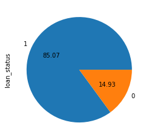
    


```python
#!pip install imblearn
```


```python
from imblearn.over_sampling import RandomOverSampler

ros=RandomOverSampler(sampling_strategy=1)
X_res, y_res=ros.fit_resample(X_train,y_train)
ax = y_res.value_counts().plot.pie(autopct='%.2f')
_=ax.set_title("Over-Sampling-Data")
```


    
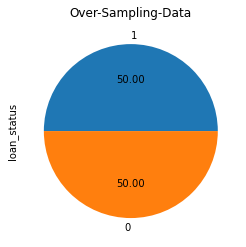
    


## **Building Models**

### **Running Models and Evaluating with graphs and indicators**

#### **Load Classification Models**


```python
from sklearn.linear_model import LogisticRegression
from sklearn.discriminant_analysis import LinearDiscriminantAnalysis
from sklearn.tree import DecisionTreeClassifier
from sklearn.neighbors import KNeighborsClassifier
from sklearn.svm import SVC
from sklearn.ensemble import AdaBoostClassifier, GradientBoostingClassifier
from sklearn.ensemble import BaggingClassifier, RandomForestClassifier, ExtraTreesClassifier
from sklearn.metrics import plot_roc_curve
from sklearn.metrics import accuracy_score,f1_score, roc_auc_score ,confusion_matrix, classification_report
from sklearn.metrics import plot_confusion_matrix
```

### **Logistic Regression**


```python
LR = LogisticRegression().fit(X_res,y_res)
LR
```


    LogisticRegression()


```python
y_pred=LR.predict(X_test)
print(confusion_matrix(y_test,y_pred))
print(classification_report(y_test, y_pred))
plot_roc_curve(LR,X_test,y_test)
```

    [[ 1619   228]
     [  397 10183]]
                  precision    recall  f1-score   support
    
               0       0.80      0.88      0.84      1847
               1       0.98      0.96      0.97     10580
    
        accuracy                           0.95     12427
       macro avg       0.89      0.92      0.90     12427
    weighted avg       0.95      0.95      0.95     12427
    
    


    <sklearn.metrics._plot.roc_curve.RocCurveDisplay at 0x1ebf360d400>


    
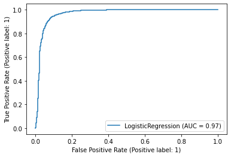
    


### **Linear Discriminant Analysis**


```python
LDA = LinearDiscriminantAnalysis().fit(X_res,y_res)
LDA
```


    LinearDiscriminantAnalysis()


```python
y_pred=LDA.predict(X_test)
print(confusion_matrix(y_test,y_pred))
print(classification_report(y_test, y_pred))
plot_roc_curve(LDA,X_test,y_test)
```

    [[ 1464   383]
     [  412 10168]]
                  precision    recall  f1-score   support
    
               0       0.78      0.79      0.79      1847
               1       0.96      0.96      0.96     10580
    
        accuracy                           0.94     12427
       macro avg       0.87      0.88      0.87     12427
    weighted avg       0.94      0.94      0.94     12427
    
    


    <sklearn.metrics._plot.roc_curve.RocCurveDisplay at 0x1ebbe1aa7f0>


    
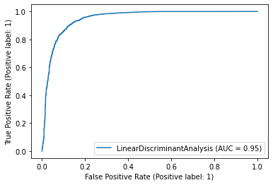
    


### **Decision Tree**


```python
DT = DecisionTreeClassifier().fit(X_res,y_res)
DT
```


    DecisionTreeClassifier()


```python
y_pred=DT.predict(X_test)
print(confusion_matrix(y_test,y_pred))
print(classification_report(y_test, y_pred))
plot_roc_curve(DT,X_test,y_test)
```

    [[ 1785    62]
     [   41 10539]]
                  precision    recall  f1-score   support
    
               0       0.98      0.97      0.97      1847
               1       0.99      1.00      1.00     10580
    
        accuracy                           0.99     12427
       macro avg       0.99      0.98      0.98     12427
    weighted avg       0.99      0.99      0.99     12427
    
    


    <sklearn.metrics._plot.roc_curve.RocCurveDisplay at 0x1ebf36445e0>


    
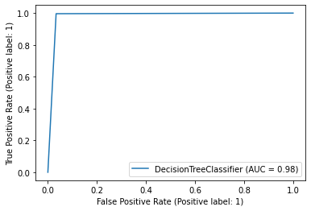
    


### **K-Nearest Neighbors Classifier**


```python
KNN = KNeighborsClassifier().fit(X_res,y_res)
KNN
```


    KNeighborsClassifier()


```python
y_pred=KNN.predict(X_test)
print(confusion_matrix(y_test,y_pred))
print(classification_report(y_test, y_pred))
plot_roc_curve(KNN,X_test,y_test)
```

    [[1024  823]
     [2200 8380]]
                  precision    recall  f1-score   support
    
               0       0.32      0.55      0.40      1847
               1       0.91      0.79      0.85     10580
    
        accuracy                           0.76     12427
       macro avg       0.61      0.67      0.63     12427
    weighted avg       0.82      0.76      0.78     12427
    
    


    <sklearn.metrics._plot.roc_curve.RocCurveDisplay at 0x1ebc319f9a0>


    
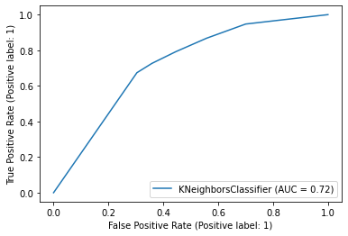
    


### **Support Vector Machine**


```python
SVM = SVC().fit(X_res,y_res)
SVM
```


    SVC()


```python
y_pred=SVM.predict(X_test)
print(confusion_matrix(y_test,y_pred))
print(classification_report(y_test, y_pred))
plot_roc_curve(SVM,X_test,y_test)
```

    [[ 1632   215]
     [  191 10389]]
                  precision    recall  f1-score   support
    
               0       0.90      0.88      0.89      1847
               1       0.98      0.98      0.98     10580
    
        accuracy                           0.97     12427
       macro avg       0.94      0.93      0.94     12427
    weighted avg       0.97      0.97      0.97     12427
    
    


    <sklearn.metrics._plot.roc_curve.RocCurveDisplay at 0x1ebf365f730>


    
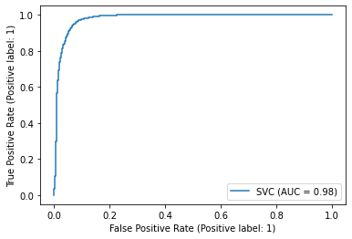
    


### **Random Forest**


```python
RF=RandomForestClassifier().fit(X_res,y_res)
RF
```


    RandomForestClassifier()


```python
y_pred=RF.predict(X_test)
print(confusion_matrix(y_test,y_pred))
print(classification_report(y_test, y_pred))
plot_roc_curve(RF,X_test,y_test)
```

    [[ 1752    95]
     [    0 10580]]
                  precision    recall  f1-score   support
    
               0       1.00      0.95      0.97      1847
               1       0.99      1.00      1.00     10580
    
        accuracy                           0.99     12427
       macro avg       1.00      0.97      0.98     12427
    weighted avg       0.99      0.99      0.99     12427
    
    


    <sklearn.metrics._plot.roc_curve.RocCurveDisplay at 0x1ebf3c5b130>


    
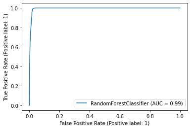
    


### **Bagging**


```python
BG=BaggingClassifier().fit(X_res,y_res)
BG
```


    BaggingClassifier()


```python
y_pred=BG.predict(X_test)
print(confusion_matrix(y_test,y_pred))
print(classification_report(y_test, y_pred))
plot_roc_curve(BG,X_test,y_test)
```

    [[ 1793    54]
     [   25 10555]]
                  precision    recall  f1-score   support
    
               0       0.99      0.97      0.98      1847
               1       0.99      1.00      1.00     10580
    
        accuracy                           0.99     12427
       macro avg       0.99      0.98      0.99     12427
    weighted avg       0.99      0.99      0.99     12427
    
    


    <sklearn.metrics._plot.roc_curve.RocCurveDisplay at 0x1ebb7275550>


    
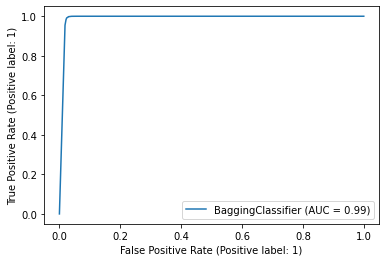
    


### **Extra Trees**


```python
ET=ExtraTreesClassifier().fit(X_res,y_res)
ET
```


    ExtraTreesClassifier()


```python
y_pred=ET.predict(X_test)
print(confusion_matrix(y_test,y_pred))
print(classification_report(y_test, y_pred))
plot_roc_curve(ET,X_test,y_test)
```

    [[ 1627   220]
     [    1 10579]]
                  precision    recall  f1-score   support
    
               0       1.00      0.88      0.94      1847
               1       0.98      1.00      0.99     10580
    
        accuracy                           0.98     12427
       macro avg       0.99      0.94      0.96     12427
    weighted avg       0.98      0.98      0.98     12427
    
    


    <sklearn.metrics._plot.roc_curve.RocCurveDisplay at 0x1ebbd62c0d0>


    
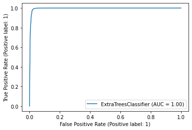
    


### **AdaBoost**


```python
AB = AdaBoostClassifier().fit(X_res,y_res)
AB
```


    AdaBoostClassifier()


```python
y_pred=AB.predict(X_test)
print(confusion_matrix(y_test,y_pred))
print(classification_report(y_test, y_pred))
plot_roc_curve(AB,X_test,y_test)
```

    [[ 1760    87]
     [   25 10555]]
                  precision    recall  f1-score   support
    
               0       0.99      0.95      0.97      1847
               1       0.99      1.00      0.99     10580
    
        accuracy                           0.99     12427
       macro avg       0.99      0.98      0.98     12427
    weighted avg       0.99      0.99      0.99     12427
    
    


    <sklearn.metrics._plot.roc_curve.RocCurveDisplay at 0x1ebf36c6a30>


    
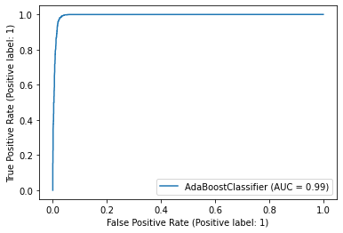
    


### **Gradient Boosting**


```python
GB = GradientBoostingClassifier().fit(X_res,y_res)
GB
```


    GradientBoostingClassifier()


```python
y_pred=GB.predict(X_test)
print(confusion_matrix(y_test,y_pred))
print(classification_report(y_test, y_pred))
plot_roc_curve(GB,X_test,y_test)
```

    [[ 1769    78]
     [    7 10573]]
                  precision    recall  f1-score   support
    
               0       1.00      0.96      0.98      1847
               1       0.99      1.00      1.00     10580
    
        accuracy                           0.99     12427
       macro avg       0.99      0.98      0.99     12427
    weighted avg       0.99      0.99      0.99     12427
    
    


    <sklearn.metrics._plot.roc_curve.RocCurveDisplay at 0x1ebbe19f7c0>


    
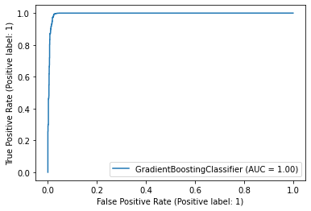
    


### **Overview Of the models**


```python
#set name for each model
models =[('LReg',LogisticRegression()),
         ('LDA',LinearDiscriminantAnalysis()),
         ('DT',DecisionTreeClassifier(random_state=1)),
         ('KNN',KNeighborsClassifier()),
         ('SVM',SVC()),
         ('RF',RandomForestClassifier(random_state=1)),
         ('BR',BaggingClassifier(random_state=1)),
         ('ExtraT',ExtraTreesClassifier(random_state=1)),
         ('Adabst',AdaBoostClassifier(random_state=1)),
         ('GBM',GradientBoostingClassifier(random_state=1))
        ]
```


```python
#fit the models and evaluate them according classification metrics
from sklearn.metrics import accuracy_score,f1_score, roc_auc_score
lacc,lf1,lauc=[],[],[]
names=[]
for name,model in models:
    model.fit(X_res,y_res)
    y_pred=model.predict(X_test)
    acc=round(accuracy_score(y_test,y_pred),2)
    lacc.append(acc)
    f1=round(f1_score(y_test,y_pred),2)
    lf1.append(f1)
    aucb=round(roc_auc_score(y_test,y_pred),2)
    lauc.append(aucb)
    names.append(name)
```


```python
#show the metrics for each model
dm=pd.DataFrame(index=names)
dm['Accuracy']=lacc
dm['F1-score']=lf1
dm['AUC']=lauc
dm
```


<div>
<style scoped>
    .dataframe tbody tr th:only-of-type {
        vertical-align: middle;
    }

    .dataframe tbody tr th {
        vertical-align: top;
    }

    .dataframe thead th {
        text-align: right;
    }
</style>
<table border="1" class="dataframe">
  <thead>
    <tr style="text-align: right;">
      <th></th>
      <th>Accuracy</th>
      <th>F1-score</th>
      <th>AUC</th>
    </tr>
  </thead>
  <tbody>
    <tr>
      <th>LReg</th>
      <td>0.95</td>
      <td>0.97</td>
      <td>0.92</td>
    </tr>
    <tr>
      <th>LDA</th>
      <td>0.94</td>
      <td>0.96</td>
      <td>0.88</td>
    </tr>
    <tr>
      <th>DT</th>
      <td>0.99</td>
      <td>0.99</td>
      <td>0.98</td>
    </tr>
    <tr>
      <th>KNN</th>
      <td>0.76</td>
      <td>0.85</td>
      <td>0.67</td>
    </tr>
    <tr>
      <th>SVM</th>
      <td>0.97</td>
      <td>0.98</td>
      <td>0.93</td>
    </tr>
    <tr>
      <th>RF</th>
      <td>0.99</td>
      <td>1.00</td>
      <td>0.98</td>
    </tr>
    <tr>
      <th>BR</th>
      <td>0.99</td>
      <td>1.00</td>
      <td>0.99</td>
    </tr>
    <tr>
      <th>ExtraT</th>
      <td>0.98</td>
      <td>0.99</td>
      <td>0.94</td>
    </tr>
    <tr>
      <th>Adabst</th>
      <td>0.99</td>
      <td>0.99</td>
      <td>0.98</td>
    </tr>
    <tr>
      <th>GBM</th>
      <td>0.99</td>
      <td>1.00</td>
      <td>0.98</td>
    </tr>
  </tbody>
</table>
</div>


## **Tuning Of Top 3 Models**

#### DecisionTreeClassifier
#### BaggingClassifier
#### GradientBoostingClassifier

### **Implementation of GridSearchCV**

#### The gridSearchCV() function will be used to preform an exhaustive search of the optimal parameter 


```python
from sklearn.model_selection import GridSearchCV

# setup of the basic model (default model)

RF=RandomForestClassifier(random_state=1)
RF.fit(X_res,y_res)
y_pred=RF.predict(X_test)
```


```python
def model_report(model):
    plot_confusion_matrix(model,X_test,y_test)
    print(classification_report(y_test,model.predict(X_test)))
    print("Training accuracy: ",RF.score(X_res,y_res))
```


```python
model_report(RF)
```

                  precision    recall  f1-score   support
    
               0       1.00      0.95      0.97      1847
               1       0.99      1.00      1.00     10580
    
        accuracy                           0.99     12427
       macro avg       1.00      0.98      0.99     12427
    weighted avg       0.99      0.99      0.99     12427
    
    Training accuracy:  1.0
    


    
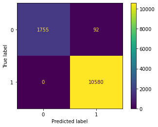
    


#### Observations & Conclusions:
###### We can see that the training accuracy of Decision Tree with default hyperparameters is 1 i.e. 100% accuracy. and when we fit the same model on testing data, the accuracy reduces to 99% approx. we'll proced to tunning to see if we can improve some accuracy prediction

### Hyperparameter Tuning

#### For Random Forest Classifier


```python
print('Actual Parameters of the RF model :')
from pprint import pprint
pprint(RF.get_params())
```

    Actual Parameters of the RF model :
    {'bootstrap': True,
     'ccp_alpha': 0.0,
     'class_weight': None,
     'criterion': 'gini',
     'max_depth': None,
     'max_features': 'auto',
     'max_leaf_nodes': None,
     'max_samples': None,
     'min_impurity_decrease': 0.0,
     'min_samples_leaf': 1,
     'min_samples_split': 2,
     'min_weight_fraction_leaf': 0.0,
     'n_estimators': 100,
     'n_jobs': None,
     'oob_score': False,
     'random_state': 1,
     'verbose': 0,
     'warm_start': False}
    

##### Parameters to investigate
- max_depth
- max_features
- min_samples_split
- min_samples_leaf


```python
#Setting values for the parameters
max_depth = [5, 10, 15, 25, 30]
min_samples_split = [2, 5, 10, 15, 100]
min_samples_leaf = [1, 2, 5, 10]
max_features = [1, 2, 5, 10]

#Creating a dictionary for the hyper parameters
hyperT = dict(max_depth = max_depth, min_samples_split = min_samples_split, 
              min_samples_leaf = min_samples_leaf, max_features=max_features)

#Applying GridSearchCV to get the best value for hyperparameters
gridRF = GridSearchCV(RF, hyperT, cv = 3, verbose = 1, n_jobs = -1)
bestRF = gridRF.fit(X_res,y_res)
```

    Fitting 3 folds for each of 400 candidates, totalling 1200 fits
    


```python
#Printing the best hyperparameters
print('The best hyper parameters are:\n',gridRF.best_params_)
```

    The best hyper parameters are:
     {'max_depth': 25, 'max_features': 5, 'min_samples_leaf': 1, 'min_samples_split': 2}
    

#### Fitting Random Forest with best Hyper parameters


```python
#Fitting the decision tree model with the best hyper parameters obtained through GridSearchCV
RF_HY = RandomForestClassifier(max_depth=25, min_samples_leaf=1,min_samples_split=2)
RF_HY.fit(X_res,y_res)
pred_RF_HY = RF_HY.predict(X_test)
```


```python
model_report(RF_HY)
```

                  precision    recall  f1-score   support
    
               0       1.00      0.95      0.97      1847
               1       0.99      1.00      1.00     10580
    
        accuracy                           0.99     12427
       macro avg       1.00      0.97      0.98     12427
    weighted avg       0.99      0.99      0.99     12427
    
    Training accuracy:  1.0
    


    

    


#### For BaggingClassifier


```python
# setup of the basic model (default model)
BG=BaggingClassifier()
BG.fit(X_res,y_res)
y_pred=BG.predict(X_test)
```


```python
model_report(BG)
```

                  precision    recall  f1-score   support
    
               0       0.99      0.97      0.98      1847
               1       0.99      1.00      1.00     10580
    
        accuracy                           0.99     12427
       macro avg       0.99      0.98      0.99     12427
    weighted avg       0.99      0.99      0.99     12427
    
    Training accuracy:  1.0
    


    

    


```python
print('Actual Parameters of the a model :')
from pprint import pprint
pprint(BG.get_params())
```

    Actual Parameters of the a model :
    {'base_estimator': None,
     'bootstrap': True,
     'bootstrap_features': False,
     'max_features': 1.0,
     'max_samples': 1.0,
     'n_estimators': 10,
     'n_jobs': None,
     'oob_score': False,
     'random_state': 1,
     'verbose': 0,
     'warm_start': False}
    

##### Parameters to investigate
- n_estimators
- max_depth
- max_samples 
- max_features 


```python
#Setting values for the parameters
n_estimators = [100, 300, 500, 800, 1200]
max_depth = [5, 10, 15, 25, 30]
max_samples = [5, 10, 25, 50, 100]
max_features = [1, 2, 5, 10, 13]

#Creating a dictionary for the hyper parameters
hyperbag = dict(n_estimators = n_estimators, max_samples = max_samples, 
              max_features = max_features)

#Applying GridSearchCV to get the best value for hyperparameters
gridbag = GridSearchCV(BG, hyperbag, cv = 3, verbose = 1, n_jobs = -1)
bestbag = gridbag.fit(X_res,y_res)
```

    Fitting 3 folds for each of 125 candidates, totalling 375 fits
    


```python
#Printing the best hyperparameters
print('The best hyper parameters are:\n',gridbag.best_params_)
```

    The best hyper parameters are:
     {'max_features': 10, 'max_samples': 100, 'n_estimators': 1200}
    

#### Fitting Bagging Classifier with hyper parameters


```python
#Fitting the bagging model with the best hyper parameters obtained through GridSearchCV
BG_HY = BaggingClassifier(max_features=10, max_samples=100,n_estimators= 1200)
BG_HY.fit(X_res,y_res)
pred_BG_HY = BG_HY.predict(X_test)
```


```python
model_report(BG_HY)
```

                  precision    recall  f1-score   support
    
               0       0.98      0.91      0.95      1847
               1       0.98      1.00      0.99     10580
    
        accuracy                           0.98     12427
       macro avg       0.98      0.95      0.97     12427
    weighted avg       0.98      0.98      0.98     12427
    
    Training accuracy:  1.0
    


    

    


#### For Gradient Boosting Classifier 


```python
# setup of the basic model (default model)
GB=GradientBoostingClassifier()
GB.fit(X_res,y_res)
y_pred=GB.predict(X_test)
```


```python
model_report(GB)
```

                  precision    recall  f1-score   support
    
               0       1.00      0.96      0.98      1847
               1       0.99      1.00      1.00     10580
    
        accuracy                           0.99     12427
       macro avg       0.99      0.98      0.99     12427
    weighted avg       0.99      0.99      0.99     12427
    
    Training accuracy:  1.0
    


    
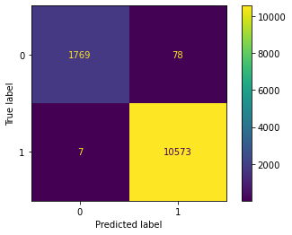
    


```python
print('Actual Parameters of the a model :')
from pprint import pprint
pprint(GB.get_params())
```

    Actual Parameters of the a model :
    {'ccp_alpha': 0.0,
     'criterion': 'friedman_mse',
     'init': None,
     'learning_rate': 0.1,
     'loss': 'deviance',
     'max_depth': 3,
     'max_features': None,
     'max_leaf_nodes': None,
     'min_impurity_decrease': 0.0,
     'min_samples_leaf': 1,
     'min_samples_split': 2,
     'min_weight_fraction_leaf': 0.0,
     'n_estimators': 100,
     'n_iter_no_change': None,
     'random_state': None,
     'subsample': 1.0,
     'tol': 0.0001,
     'validation_fraction': 0.1,
     'verbose': 0,
     'warm_start': False}
    

#### Fitting Gradient Boosting Classifier with hyper parameters


```python
learning_rate=[0.15,0.1,0.05,0.01,0.005]
n_estimators=[1, 2, 5, 10, 13,15,17,19]
max_features=[2,3,4,5,6,7,9,12]

#Creating a dictionary for the hyper parameters
hypergb = dict(n_estimators = n_estimators, learning_rate = learning_rate, 
              max_features = max_features)

#Applying GridSearchCV to get the best value for hyperparameters
gridgb = GridSearchCV(GB, hypergb, cv = 3, verbose = 1, n_jobs = -1)
bestgb = gridgb.fit(X_res,y_res)
```

    Fitting 3 folds for each of 320 candidates, totalling 960 fits
    


```python
#Printing the best hyperparameters
print('The best hyper parameters are:\n',bestgb.best_params_)
```

    The best hyper parameters are:
     {'learning_rate': 0.15, 'max_features': 12, 'n_estimators': 19}
    


```python
#Fitting the bagging model with the best hyper parameters obtained through GridSearchCV
GB_HY = GradientBoostingClassifier(max_features=12, learning_rate=0.15,n_estimators= 19)
GB_HY.fit(X_res,y_res)
pred_GBM_HY = GB_HY.predict(X_test)
```


```python
model_report(GB_HY)
```

                  precision    recall  f1-score   support
    
               0       1.00      0.91      0.95      1847
               1       0.98      1.00      0.99     10580
    
        accuracy                           0.99     12427
       macro avg       0.99      0.95      0.97     12427
    weighted avg       0.99      0.99      0.99     12427
    
    Training accuracy:  1.0
    


    
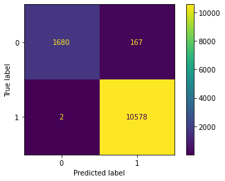
    


### The model selected is Random Forest


```python
model_report(RF_HY)
```

                  precision    recall  f1-score   support
    
               0       1.00      0.95      0.97      1847
               1       0.99      1.00      1.00     10580
    
        accuracy                           0.99     12427
       macro avg       1.00      0.97      0.98     12427
    weighted avg       0.99      0.99      0.99     12427
    
    Training accuracy:  1.0
    


    

    


#### The confusion matrix shows us that the model has been trained well to predict x test 
#### in 0 "charged off" section he miss 93 predicting them as fully paid
#### and 0 miss in fully paid section

###  Model saving


```python
import pickle
filename = 'RF_HY.pkl'
pickle.dump(RF_HY, open(filename, 'wb'))
```


```python
#to load a saved model
RF_HY = pickle.load(open("RF_HY.pkl", "rb"))
```


```python
#the you can use the loaded model
RF_HY.predict(X_test)
```


    array([1, 0, 1, ..., 1, 1, 0])


```python
#the you can use the loaded model
RF_HY.predict_proba(X_test)
```


    array([[0.  , 1.  ],
           [0.87, 0.13],
           [0.02, 0.98],
           ...,
           [0.  , 1.  ],
           [0.02, 0.98],
           [1.  , 0.  ]])


```python

```
