**PROJET MACHINE LEARNING ON LENDING CLUB DATASET**

**Réalisé par Abdelhadi CHAJIA**

Le lien de l’application déployé en « Heroku »

<https://loan-predictor-app-st.herokuapp.com/>

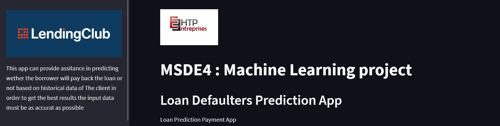

**Les étapes suivies Jusqu’à déploiement**

1\. Définition de l’objectifs

2\. Analyse Exploratoire

3\. Préparation des données

4\. Modélisation

5\. Tuning des modéles

7 Choix du Modèle Meilleur

6\. Déploiement (réévaluation régulière)

**Etape N°1 : Définition des objectifs**

1.  On a un problème de classification de type supervisé
2.  Compte tenu des données historiques sur les prêts accordés avec des informations indiquant si l'emprunteur dans la data set, On peut construire un modèle qui peut prédire si un emprunteur remboursera ou non son prêt ?(Lending club dataset)

La colonne « Loan Status » constitue la variable à prédire avec les valeurs suivantes :

-   Fully Paid
-   Charged OFF

Ps : la colonne contiennes plusieurs valeurs j’ai remplacé les valeurs positive en « Fully Paid » et les valeurs négatives en « Charged Off » je vais détailler l’explication de cette variable dans l’etape de Préparation des données

**Etape N°2 : Analyse Exploratoire**

1.  Partie compréhension de la data

Afficher le Typologie de chaque variable : Numérique, temporelle, textuelle, binaire, pour savoir les traites après dans la partie preprocessing Ex :

**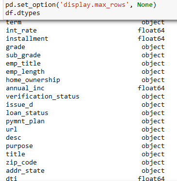**

1.  Partie Graphiques
-   Ploter chaque variable pour avoir une idée sur la distribution de chaque variable et l’information qu’elle contienne Ex :

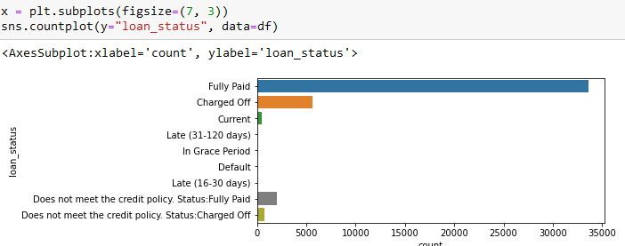

**Etape N°3 : Préparation des données**

Cette phase c’est dans l’objectif de préparer les variables pour qu'elles puissent être exploitées par les algorithmes de Machine Learning

J’ai uploadé le dictionnaire des variables pour bien comprendre l’utilité de chaque variable et détecter aussi les variables redondantes

1.  Détecter les valeurs manquantes

    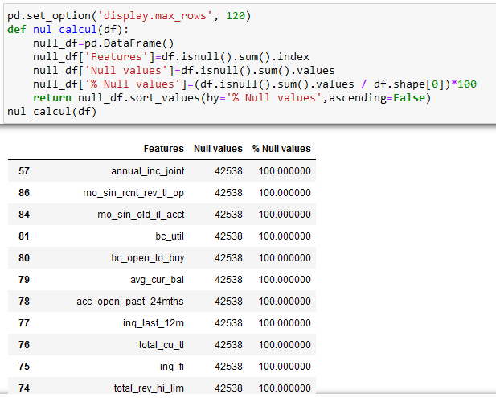

La suppression des variables se fait sur la base du quantité des valeurs manquants

Ceux qui ont au-delà de 1% de donnée sont à supprimer.

Les variables temporelles aussi sont à supprimer car on a beaucoup de variable numérique pas la peine de les intégré aussi dans le modèle

Les variables redondantes : il y en a des variables dont l’information se répète plusieurs fois

1.  Features Engineering
2.  L’encodage des variables catégorielle
3.  verification_status
4.  home_ownership
5.  emp_length

L’encodage est fait sur la nature des valeurs présenté dans la variable Il y’en a qui sont encodé en label Ex :

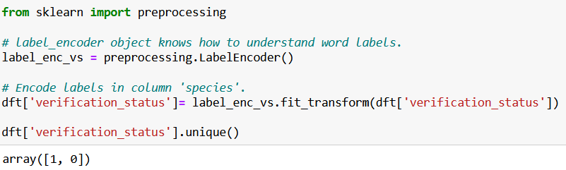

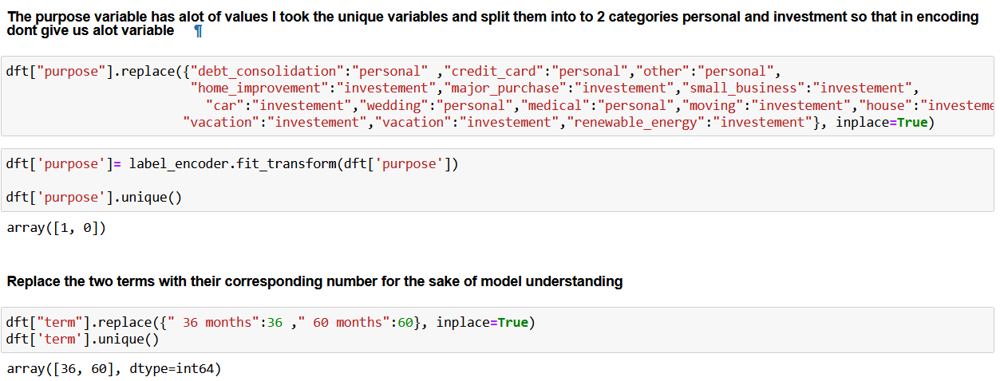

Il y’en a qui sont encodé ordinal

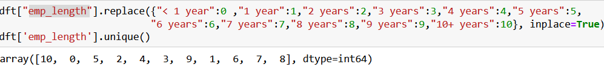

1.  les variables redondantes

Les variables qui présents des informations similaire et dans la distribution sont linéament projeté j’ai calculé la moyenne dans un nouveau variables en supprimant les initiaux Ex :

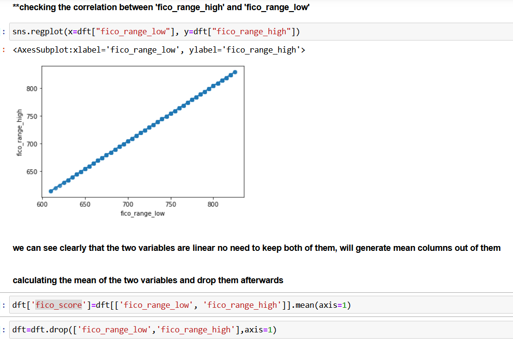

**Etape N°4 : Modélisation**

Se compose de 4 phase

1.  **Data splite en Train set en 70% et Test set en 30%**

Comment fonctionne le fractionnement des données

Je divise les données en deux parties, la partie de données de Training est utilisé pour former et développer des modèles. La partie de test est utilisés pour estimer différents paramètres ou pour comparer les performances de différents modèles Ex

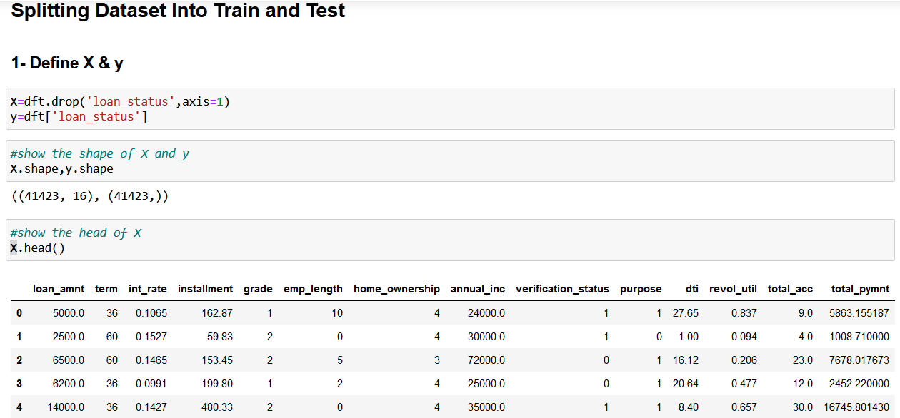

1.  **Scalling (Normalisation des données)**

Scalling des données afin qu’on puisse avoir la même échelle et que le modèle ne favorise pas une variable par rapport à l'autre Ex :

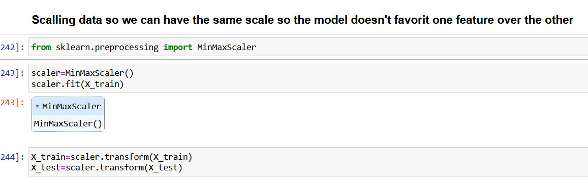

1.  **Balancer la data**

On a dans la variable cible une distribution des observations inégale ce rendre la tache un peu facile pour l’algorithme à prédire et que ne donne pas assez de crédibilité Ex :

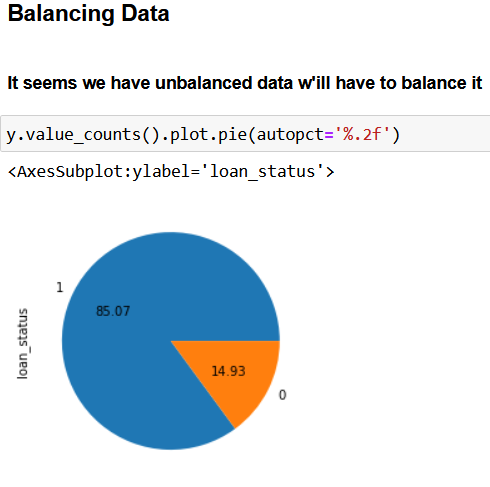

Après équilibrage de données

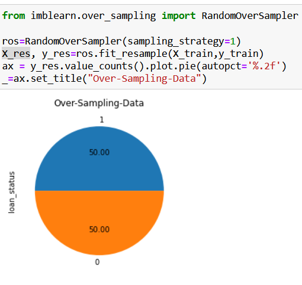

1.  **Construction des modéles**

Lors de cette étape, J’ai testé 10 algorithmes de classification qui me semblent les mieux adaptés.

1.  Logistic Regression
2.  Linear Discriminant Analysis
3.  Decision Tree
4.  K-Nearest Neighbors Classifier
5.  Support Vector Machine
6.  Random Forest
7.  Bagging
8.  Extra Trees
9.  AdaBoost
10. Gradient Boosting

Pour chaque algorithme j’ai trainer le model sur X_train, y_train puis j’ai predit X_test et j’ai comparé les resultats avec y_test Ex :

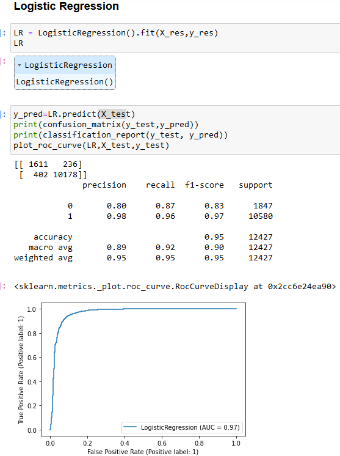

On a une accuracy de 95% ce qui est bon considerons le nombre d’observation

La matrice de confusion on voit qu’il a raté 638 sur 12427 observations ce qui bonne

le même démarche appliquer sur les 9 autres algorithms

**Etape N°5 : Tuning**

J’ai choisi 3 modèles dont les résultats sont meilleurs par rapport aux autres

Pour le tuning j’ai choisi la méthode de gride searchcv

J’ai comparé le modèle initial avec ses paramètres qui sont par défaut puis j’ai augmenté un peu les valeurs de chaque paramètre puis j’ai testé les nouveau paramétré généré sur le modèle choisi

EX :

**Etape N°6 : Choix du Modèle Meilleur**

1.  

J’ai choisi le model decision Tree Parce qu’il présent des résultats optimaux par rapport autres

1.  Enregistrement sous Extension PKL Ex :

    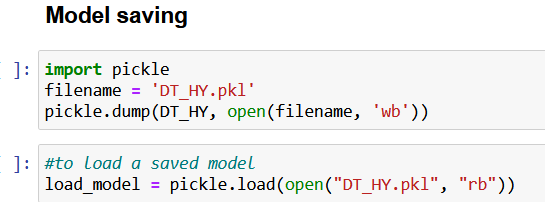

**Etape N°7 : Déploiement (réévaluation régulière)**

1.  Developé un script stream lit

J’ai developé un script streamlit à l’aide de la page officiel de streamlit en définissons les variables testé par le model dans streamlit et construire des gadgets et éditeurs de donnée Ex :

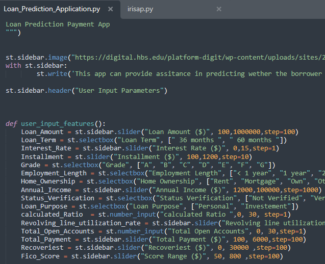

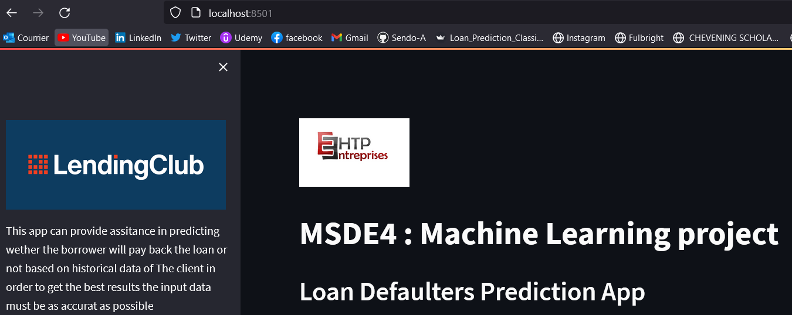

1.  Déploiement sur Heroku

    Lors de la déploiement j’ai suivi les étaps suivant

    1.  Définir un projet de répertoire
    2.  Générer les versions de librairie pythons (reuirement)
    3.  setup.sh et Profile
    4.  reating a Git repository
    5.  Créer un compte Heroku
    6.  Installation de l'interface de ligne de commande Heroku (CLI)
    7.  Connecter à Heroku

J’ai rencontré un problème lors de dépliement avec les versions de librairie de python ils étaient pas compatibles avec heroku j’étais oblige de réinstaller les versions en conda shell et installer ceux qui sont adéquate avec heroku

FIN

.
